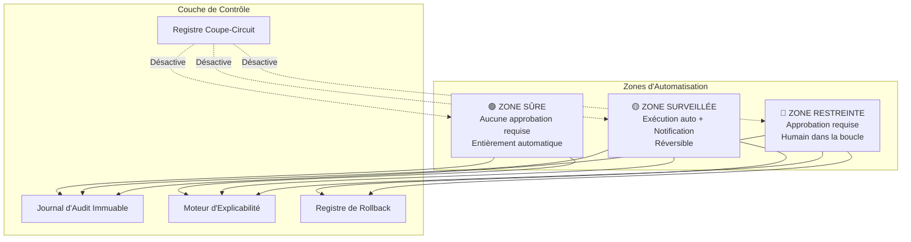
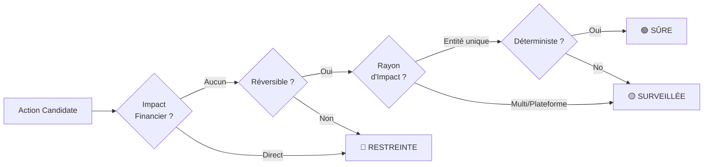
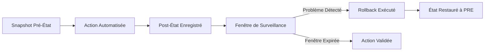
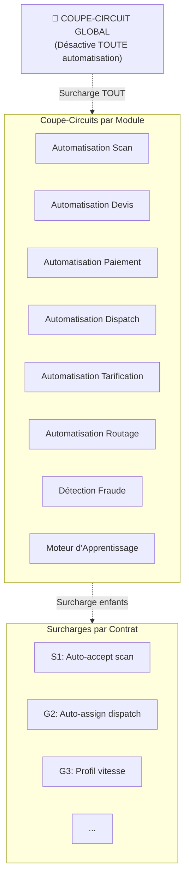
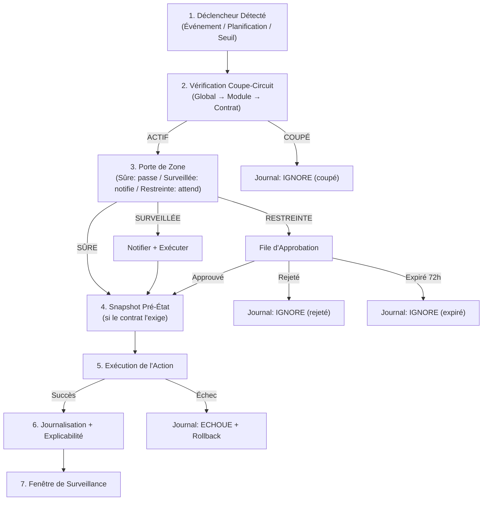
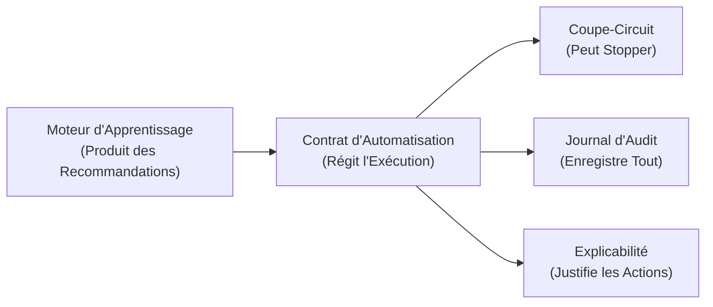

# TransLogistics — Spécification de Gouvernance de l'Automatisation Partielle

> **Version** : 1.0 — 2026-02-07
> **Auteur** : Lead Automation Architect
> **Statut** : BROUILLON — En attente de revue
> **Prérequis** : [LEARNING_SYSTEM_SPEC.md](file:///Users/user/Documents/DEVELOPPEMENTS/Projets/TransLogistics/docs/LEARNING_SYSTEM_SPEC.md), [DOMAIN_SPECIFICATION.md](file:///Users/user/Documents/DEVELOPPEMENTS/Projets/TransLogistics/docs/DOMAIN_SPECIFICATION.md)

---

## 1. Résumé Exécutif

Cette spécification définit un **cadre de gouvernance de l'automatisation partielle** pour la plateforme TransLogistics. Elle établit quelles opérations peuvent être automatisées, sous quelles conditions, avec quelles garanties, et comment l'automatisation peut être stoppée à tout moment.

Le cadre repose sur un principe fondamental unique :

> **L'automatisation sert l'humain. L'humain surpasse l'automatisation. Toujours.**

Chaque action automatisée est :
- **Classifiée** dans l'une des trois zones (Sûre, Surveillée, Restreinte)
- **Régie** par un contrat explicite (déclencheur, périmètre, rollback)
- **Réversible** dans une fenêtre de rétractation définie
- **Journalisée** dans un registre d'audit immuable
- **Explicable** avec un raisonnement lisible par un humain
- **Arrêtable** au niveau global ou par module



---

## 2. Zones d'Automatisation

### 2.1 Critères de Classification

Chaque action potentiellement automatisable est classifiée selon **quatre dimensions de risque** :

| Dimension | Question | Risque Faible | Risque Élevé |
|:---|:---|:---|:---|
| **Impact Financier** | Touche-t-elle à l'argent ? | Aucun effet financier direct | Modifie tarifs, paiements ou marges |
| **Réversibilité** | Peut-on annuler ? | Entièrement réversible (état soft) | Irréversible (client, juridique) |
| **Rayon d'Impact** | Combien d'entités touchées ? | Entité unique (un colis) | Multi-entités ou plateforme entière |
| **Confiance** | Quelle certitude ? | Déterministe (règle métier) | Probabiliste (dérivé ML) |



---

### 2.2 🟢 ZONE SÛRE — Aucune Approbation Requise

Actions **déterministes, réversibles, à entité unique et sans impact financier**. Elles s'exécutent automatiquement et silencieusement.

| # | Action | Domaine | Déclencheur | Justification |
|:---|:---|:---|:---|:---|
| S1 | **Auto-acceptation scan haute confiance** | ScanResult | `confidence >= SEUIL_AUTO_ACCEPT` | Seuil déterministe ; dimensions corrigeables après coup |
| S2 | **Expiration devis périmés** | Quote | `expiresAt < now() ET status = PENDING` | Temporel, déterministe, sans effet financier |
| S3 | **Expiration intentions de paiement** | Payment | `expiresAt < now() ET status IN (INITIATED, PENDING)` | Nettoyage ; le paiement peut être retenté |
| S4 | **Génération code de suivi** | Shipment | Création d'expédition | Purement génératif, aucune logique métier |
| S5 | **Enregistrement métriques d'optimisation** | Dispatch | Fin d'optimisation de route | Observabilité uniquement, aucun effet de bord |
| S6 | **Capture retour scan** | Learning | Correction manuelle enregistrée | Collecte passive, aucun changement en production |
| S7 | **Capture données réelles de tournée** | Learning | RoutePlan complété | Collecte passive |
| S8 | **Calcul snapshots analytiques nocturnes** | Analytics | Cron planifié (02h00) | Agrégation en lecture seule, aucune mutation |
| S9 | **Envoi notifications de suivi** | Notification | Changement de statut expédition | Informationnel, aucune mutation d'état |
| S10 | **Marquage parrainage expiré** | Referral | Dépassement 30 jours | Déterministe, réversible |

#### Invariants de la Zone Sûre

1. **Aucune mutation financière** — Les actions sûres ne modifient jamais montants, prix ou statuts de paiement
2. **Périmètre mono-entité** — Chaque exécution affecte exactement une entité
3. **Déclencheur déterministe** — Basé sur des règles, aucune confiance ML impliquée (sauf S1 qui utilise un seuil)
4. **Exécution silencieuse** — Pas de notification opérateur (journalisée mais non surfacée)

---

### 2.3 🟡 ZONE SURVEILLÉE — Exécution Automatique + Notification

Actions **généralement sûres mais à rayon d'impact plus large, impliquant une confiance probabiliste, ou touchant des workflows opérationnels**. Elles s'exécutent automatiquement mais créent une notification au responsable humain.

| # | Action | Domaine | Déclencheur | Notifier Qui | Fenêtre de Rétractation |
|:---|:---|:---|:---|:---|:---|
| G1 | **Signalement scan confiance moyenne** | ScanResult | `SEUIL_MANUEL <= confidence < SEUIL_AUTO_ACCEPT` | Opérateur Hub | Jusqu'à acceptation devis |
| G2 | **Affectation auto dispatch** | Dispatch | Nouvelle expédition CONFIRMED dans un hub | Opérateur Hub | Jusqu'au départ chauffeur |
| G3 | **Application mise à jour profil vitesse** | Routing | Fenêtre d'approbation 30 jours expirée (pas de rejet) | Admin Plateforme | 7 jours de surveillance |
| G4 | **Déclenchement signal fraude** | Fraud | Seuil de règle dépassé | Équipe Opérations | Cycle de vie investigation |
| G5 | **Suspension route sur dégradation performance** | Route | Marge < 0% pendant 3 jours consécutifs | Admin Plateforme | Réactivation manuelle |
| G6 | **Désactivation batch job en échec répété** | Learning | Job échoue 3 exécutions consécutives | Admin Plateforme | Redémarrage manuel |
| G7 | **Coupe-circuit endpoint webhook** | API | Débit dépasse le seuil du coupe-circuit | Admin Plateforme | Reset auto après refroidissement |
| G8 | **Rollback auto profil vitesse** | Routing | Erreur d'estimation augmente > seuil post-déploiement | Admin Plateforme | Immédiat |
| G9 | **Alerte taux de fallback OR-Tools** | Dispatch | Taux de fallback dépasse le seuil sur fenêtre glissante | Admin Plateforme | N/A (observabilité) |
| G10 | **Synchronisation statuts expéditions par lot** | Shipment | Complétion de DispatchTask affectant plusieurs expéditions | Opérateur Hub | Rétractation par expédition |

#### Invariants de la Zone Surveillée

1. **Notification obligatoire** — Chaque action Surveillée crée une notification sous 60 secondes
2. **Fenêtre de rétractation explicite** — Chaque action déclare combien de temps elle peut être annulée
3. **Chemin d'escalade** — Si la notification n'est pas acquittée dans la fenêtre, l'action est escaladée au niveau hiérarchique supérieur
4. **Automatisation bornée** — Aucune action Surveillée ne peut s'exécuter plus de `MAX_GUARDED_BATCH` fois par heure sans acquittement humain

---

### 2.4 🔴 ZONE RESTREINTE — Approbation Requise

Actions à **impact financier, irréversibles, multi-entités ou modificatrices de politique**. Elles ne s'exécutent **jamais sans approbation humaine explicite**.

| # | Action | Domaine | Approbation Requise De | Pourquoi Restreinte |
|:---|:---|:---|:---|:---|
| R1 | **Déploiement changement règle de tarification** | Pricing | SUPER_ADMIN | Impact financier direct sur tous les futurs devis |
| R2 | **Application calibration scan** | Learning | ADMIN | Modifie le comportement IA sur tous les hubs |
| R3 | **Application recommandation tarifaire** | Learning | SUPER_ADMIN + Commercial | Impact revenu, implications contractuelles |
| R4 | **Modification seuils détection fraude** | Fraud | SUPER_ADMIN | Change la sensibilité d'investigation |
| R5 | **Émission remboursement** | Payment | ADMIN | Reversal financier direct |
| R6 | **Annulation expédition confirmée** | Shipment | ADMIN | Visible client, déclenche remboursement |
| R7 | **Suspension/fermeture d'un hub** | Hub | SUPER_ADMIN | Arrête toutes les opérations du site |
| R8 | **Dépréciation d'une route** | Route | SUPER_ADMIN | Bloque les nouvelles expéditions sur le corridor |
| R9 | **Activation mode automatisation graduelle** | Learning | SUPER_ADMIN | Change la posture de gouvernance de l'automatisation |
| R10 | **Promotion version modèle en production** | Learning | SUPER_ADMIN | Remplace le comportement IA |
| R11 | **Dérogation à un invariant domaine** | Tout | SUPER_ADMIN + justification écrite | Enfreint une règle métier déclarée |
| R12 | **Migration/correction de données en masse** | Tout | SUPER_ADMIN | Multi-entités, potentiellement irréversible |

#### Invariants de la Zone Restreinte

1. **Aucun contournement** — Aucun chemin de code ne peut exécuter une action Restreinte sans `approvedByUserId`
2. **Règle des deux personnes pour R1, R3, R11** — Les actions financières/politiques nécessitent deux approbateurs distincts
3. **Justification écrite pour R11** — Les dérogations aux invariants doivent inclure une explication écrite
4. **Expiration de l'approbation** — Les approbations en attente expirent après 72 heures

---

## 3. Contrats d'Automatisation

Chaque action automatisée (Sûre, Surveillée ou Restreinte) est régie par un **Contrat d'Automatisation** — une déclaration formelle du déclencheur, du périmètre et du rollback.

### 3.1 Schéma du Contrat

```typescript
interface ContratAutomatisation {
  // Identité
  id: string;                                // ex. "S1", "G2", "R5"
  nom: string;                               // Nom lisible par un humain
  zone: 'SURE' | 'SURVEILLEE' | 'RESTREINTE';
  module: ModuleAutomatisation;              // Module propriétaire

  // Déclencheur
  declencheur: {
    type: 'EVENEMENT' | 'PLANIFIE' | 'SEUIL' | 'APPROBATION';
    condition: string;                       // Condition en langage naturel
    evenementSource?: string;                // Événement domaine déclencheur
    planification?: string;                  // Expression cron si PLANIFIE
    metriqueSeuil?: string;                  // Nom de la métrique si SEUIL
  };

  // Périmètre
  perimetre: {
    typeEntite: string;                      // ex. 'ScanResult', 'Quote'
    portee: 'UNIQUE' | 'LOT' | 'PLATEFORME';
    tailleLotMax?: number;                   // Max entités par exécution
    aggregatsAffectes: string[];             // Agrégats touchés
  };

  // Exécution
  execution: {
    estIdempotent: boolean;                  // Peut être ré-exécuté ?
    dureeMaxMs: number;                      // Timeout
    politiqueRetry: 'AUCUN' | 'UNE_FOIS' | 'EXPONENTIEL';
    limiteConcurrence: number;               // Max exécutions parallèles
  };

  // Rollback
  rollback: {
    estReversible: boolean;
    fenetreRollbackMinutes: number;          // 0 = non réversible
    methodeRollback: 'RESTAURATION_ETAT' | 'ACTION_COMPENSATOIRE' | 'MANUELLE';
    snapshotEtatRequis: boolean;             // Capturer état avant ?
  };

  // Observabilité
  observabilite: {
    notifierExecution: boolean;
    rolesNotifies: string[];                 // Rôles à notifier
    fenetreEscaladeMinutes: number;          // Délai avant escalade
    metriquesEmises: string[];               // Noms compteurs/jauges
  };
}

type ModuleAutomatisation =
  | 'SCAN'
  | 'DEVIS'
  | 'PAIEMENT'
  | 'EXPEDITION'
  | 'DISPATCH'
  | 'TARIFICATION'
  | 'ROUTAGE'
  | 'FRAUDE'
  | 'APPRENTISSAGE'
  | 'ANALYTIQUE'
  | 'NOTIFICATION'
  | 'PARRAINAGE';
```

### 3.2 Exemples de Contrats

#### Contrat S2 : Expiration des Devis Périmés

```yaml
id: S2
nom: "Expiration des Devis Périmés"
zone: SURE
module: DEVIS

declencheur:
  type: PLANIFIE
  condition: "Toutes les 5 minutes, rechercher les devis où expiresAt < now() ET status = PENDING"
  planification: "*/5 * * * *"

perimetre:
  typeEntite: Quote
  portee: LOT
  tailleLotMax: 100
  aggregatsAffectes: [Shipment]

execution:
  estIdempotent: true
  dureeMaxMs: 10000
  politiqueRetry: UNE_FOIS
  limiteConcurrence: 1

rollback:
  estReversible: false           # L'expiration est permanente par design
  fenetreRollbackMinutes: 0
  methodeRollback: MANUELLE
  snapshotEtatRequis: false

observabilite:
  notifierExecution: false
  rolesNotifies: []
  fenetreEscaladeMinutes: 0
  metriquesEmises: ["automation.devis_expires.count"]
```

#### Contrat G2 : Affectation Automatique des Tâches de Dispatch

```yaml
id: G2
nom: "Affectation Automatique des Tâches de Dispatch"
zone: SURVEILLEE
module: DISPATCH

declencheur:
  type: EVENEMENT
  condition: "Nouvelle expédition atteint le statut CONFIRMED dans un hub avec chauffeurs disponibles"
  evenementSource: ShipmentConfirmed

perimetre:
  typeEntite: DispatchTask
  portee: UNIQUE
  aggregatsAffectes: [Dispatch, Driver]

execution:
  estIdempotent: true
  dureeMaxMs: 5000
  politiqueRetry: UNE_FOIS
  limiteConcurrence: 5

rollback:
  estReversible: true
  fenetreRollbackMinutes: 60     # Jusqu'au départ du chauffeur
  methodeRollback: RESTAURATION_ETAT
  snapshotEtatRequis: true

observabilite:
  notifierExecution: true
  rolesNotifies: [HUB_OPERATOR]
  fenetreEscaladeMinutes: 30
  metriquesEmises: ["automation.dispatch_affecte_auto.count", "automation.dispatch_temps_affectation.histogram"]
```

#### Contrat R1 : Déploiement d'un Changement de Règle Tarifaire

```yaml
id: R1
nom: "Déploiement Changement Règle Tarifaire"
zone: RESTREINTE
module: TARIFICATION

declencheur:
  type: APPROBATION
  condition: "PricingRecommendation approuvée par SUPER_ADMIN ET responsable Commercial"

perimetre:
  typeEntite: PricingRule
  portee: UNIQUE               # Une route à la fois
  aggregatsAffectes: [Route]

execution:
  estIdempotent: false          # L'incrémentation de version n'est pas idempotente
  dureeMaxMs: 5000
  politiqueRetry: AUCUN
  limiteConcurrence: 1

rollback:
  estReversible: true
  fenetreRollbackMinutes: 10080   # 7 jours
  methodeRollback: RESTAURATION_ETAT  # Réactiver la version précédente
  snapshotEtatRequis: true

observabilite:
  notifierExecution: true
  rolesNotifies: [SUPER_ADMIN, PLATFORM_ADMIN]
  fenetreEscaladeMinutes: 0     # Visibilité immédiate
  metriquesEmises: ["automation.tarification_deployee.count", "automation.tarification_delta_marge.gauge"]
```

---

## 4. Règles de Sécurité Globales

Ces règles s'appliquent à **toutes** les actions automatisées, quelle que soit la zone. Ce sont des **invariants non négociables**.

### 4.1 Règle 1 — Réversibilité

> **Toute action automatisée doit être réversible, ou explicitement déclarée irréversible avec justification écrite.**

| Aspect | Exigence |
|:---|:---|
| **Snapshot d'état** | Les actions Surveillées et Restreintes doivent capturer l'état de l'entité avant mutation |
| **Méthode de rollback** | Doit être l'une de : `RESTAURATION_ETAT`, `ACTION_COMPENSATOIRE`, ou `MANUELLE` |
| **Fenêtre de rollback** | Minimum 60 minutes pour les Surveillées, minimum 24 heures pour les Restreintes |
| **Déclarée irréversible** | Seules les actions de Zone Sûre peuvent être irréversibles (ex. expiration) |
| **Test du rollback** | Chaque chemin de rollback doit être testé avant l'activation du contrat |



### 4.2 Règle 2 — Journalisation

> **Toute action automatisée doit produire un enregistrement d'audit immuable, en mode ajout uniquement (append-only).**

```typescript
interface EntreeAuditAutomatisation {
  // Identité
  id: string;                            // UUID
  contratId: string;                     // Référence au ContratAutomatisation.id
  versionContrat: string;                // Quelle version du contrat
  executionId: string;                   // Unique par exécution

  // Ce qui s'est passé
  action: 'DECLENCHE' | 'EXECUTE' | 'IGNORE' | 'ECHOUE'
        | 'ROLLBACK' | 'ESCALADE' | 'COUPE';
  zone: 'SURE' | 'SURVEILLEE' | 'RESTREINTE';
  module: ModuleAutomatisation;

  // Contexte
  typeEntite: string;
  entiteId: string;
  nombreEntitesAffectees: number;        // Pour les actions par lot

  // Causalité
  declenchePar: 'SYSTEME' | 'EVENEMENT' | 'PLANIFICATION' | 'HUMAIN';
  evenementDeclencheurId?: string;       // Événement domaine source
  approuveParUserId?: string;            // Pour la zone RESTREINTE

  // Explicabilité (Règle 3)
  raisonnement: string;                  // Explication lisible par un humain
  preuves: Record<string, unknown>;      // Données brutes ayant causé le déclenchement

  // État
  etatAvant?: unknown;                   // Snapshot avant (Surveillée/Restreinte)
  etatApres?: unknown;                   // Snapshot après

  // Temporalité
  declencheA: Date;
  executeA?: Date;
  completeA?: Date;
  dureeMs?: number;

  // Résultat
  succes: boolean;
  messageErreur?: string;
  rollbackRequis: boolean;
  rollbackCompleteA?: Date;
}
```

#### Invariants de Journalisation

1. **Immuable** — Jamais de `UPDATE` ou `DELETE` sur `EntreeAuditAutomatisation`
2. **Écriture synchrone** — L'entrée est créée AVANT l'exécution de l'action (`action: DECLENCHE`), puis complétée par une nouvelle entrée `EXECUTE` à la fin
3. **Rétention** — Minimum 3 ans pour les actions financières, 1 an pour toutes les autres
4. **Interrogeable** — Doit supporter les requêtes par : `contratId`, `module`, `entiteId`, `zone`, `declenchePar`, `plageDates`
5. **Sécurité de volume** — Les actions de Zone Sûre peuvent utiliser la journalisation par lot (une entrée par lot, non par entité)

### 4.3 Règle 3 — Explicabilité

> **Toute action automatisée doit produire une explication lisible par un humain de POURQUOI elle s'est exécutée.**

| Composant | Exigence | Exemple |
|:---|:---|:---|
| **Raisonnement** | Phrase en langage naturel | "Le devis QT-1234 a expiré car sa période de validité (60 min) s'est terminée à 14h32 UTC" |
| **Preuves** | Données structurées qui ont déclenché l'action | `{ quoteId: "QT-1234", expiresAt: "2026-02-07T14:32:00Z", checkedAt: "2026-02-07T14:35:00Z" }` |
| **Référence contrat** | Quel contrat d'automatisation a régi l'action | `{ contratId: "S2", versionContrat: "1.0" }` |
| **Lignage** | Quel événement ou donnée en amont a causé l'action | `{ evenementDeclencheurId: "cron-run-2026-02-07-14-35" }` |

#### Principes d'Explicabilité

1. **Pas de nombres magiques** — Si un seuil a déclenché l'action, la valeur du seuil et sa source doivent figurer dans les preuves
2. **Chaîne causale** — Pour les automatisations multi-étapes, chaque étape doit référencer l'`executionId` de l'étape précédente
3. **Contrefactuel** — Pour les actions Surveillées et Restreintes, le journal doit inclure ce qui se serait passé si l'action n'avait PAS été prise (ex. "Sans expiration, le devis serait resté PENDING indéfiniment")
4. **Requêtable par un humain** — Tout opérateur avec le rôle `ADMIN` peut inspecter la chaîne de raisonnement complète via le Tableau de Bord d'Automatisation

---

## 5. Mécanisme Coupe-Circuit (Kill Switch)

### 5.1 Architecture



### 5.2 Modèle de Données du Coupe-Circuit

```typescript
interface EtatCoupeCircuit {
  // Global
  globalActif: boolean;                      // true = automatisation active
  globalDesactiveA?: Date;
  globalDesactiveParUserId?: string;
  globalDesactiveRaison?: string;

  // Par module
  etatsModules: Record<ModuleAutomatisation, {
    actif: boolean;
    desactiveA?: Date;
    desactiveParUserId?: string;
    desactiveRaison?: string;
  }>;

  // Surcharges par contrat
  surchargesContrats: Record<string, {       // Clé = contratId
    actif: boolean;
    desactiveA?: Date;
    desactiveParUserId?: string;
    desactiveRaison?: string;
    desactiveJusqua?: Date;                  // Désactivation temporaire optionnelle
  }>;
}
```

### 5.3 Règles du Coupe-Circuit

| Règle | Description |
|:---|:---|
| **Cascade** | Global OFF → tous les modules OFF, quel que soit l'état du module |
| **Dominance module** | Module OFF → tous les contrats du module OFF, quel que soit l'état du contrat |
| **Effet instantané** | Le coupe-circuit prend effet en moins d'1 seconde (état en mémoire + Redis pub/sub) |
| **Pas de reprise auto** | Un switch coupé doit être manuellement réactivé par `ADMIN` ou `SUPER_ADMIN` |
| **Audit journalisé** | Chaque basculement crée une `EntreeAuditAutomatisation` avec `action: COUPE` |
| **Désactivation temporaire** | Les contrats peuvent être désactivés jusqu'à une date précise (réactivation auto) |
| **Health check** | L'état du coupe-circuit est exposé via le endpoint `/health/automation` |

### 5.4 Logique de Résolution du Coupe-Circuit

```
function estAutomationActive(contratId: string): boolean {
  // 1. Vérifier le global
  if (!coupeCircuit.globalActif) return false;

  // 2. Vérifier le module
  const contrat = getContrat(contratId);
  const etatModule = coupeCircuit.etatsModules[contrat.module];
  if (!etatModule.actif) return false;

  // 3. Vérifier la surcharge par contrat
  const surcharge = coupeCircuit.surchargesContrats[contratId];
  if (surcharge) {
    if (!surcharge.actif) {
      // Vérifier si la désactivation temporaire a expiré
      if (surcharge.desactiveJusqua && surcharge.desactiveJusqua < now()) {
        return true;  // Réactivation auto (délai expiré)
      }
      return false;
    }
  }

  // 4. Par défaut : activé
  return true;
}
```

### 5.5 Contrôle d'Accès du Coupe-Circuit

| Opération | Rôle Requis |
|:---|:---|
| Consulter l'état du coupe-circuit | `OPERATOR`, `ADMIN`, `SUPER_ADMIN` |
| Basculer un switch par contrat | `ADMIN`, `SUPER_ADMIN` |
| Basculer un switch par module | `SUPER_ADMIN` |
| Basculer le switch global | `SUPER_ADMIN` uniquement |

---

## 6. Moteur d'Exécution de l'Automatisation

### 6.1 Pipeline d'Exécution

Chaque action automatisée passe par le même pipeline, quelle que soit la zone :



### 6.2 Matrice d'Escalade

Si une notification d'action Surveillée reste non acquittée :

| Temps Depuis Notification | Action |
|:---|:---|
| T + 0 | Notification envoyée au rôle principal (ex. HUB_OPERATOR) |
| T + fenêtre d'escalade | Escalade au niveau hiérarchique suivant (ex. HUB_ADMIN) |
| T + 2× fenêtre d'escalade | Escalade à PLATFORM_ADMIN |
| T + 3× fenêtre d'escalade | Journalisé comme non acquitté, maintien (action déjà exécutée) |

---

## 7. Surfaces d'Automatisation par Module

Résumé des actions automatisables par module :

| Module | Sûre | Surveillée | Restreinte | Total |
|:---|:---:|:---:|:---:|:---:|
| **Scan** | 1 (S1) | 1 (G1) | 1 (R2) | 3 |
| **Devis** | 1 (S2) | — | — | 1 |
| **Paiement** | 1 (S3) | — | 1 (R5) | 2 |
| **Expédition** | 1 (S4) | 1 (G10) | 1 (R6) | 3 |
| **Dispatch** | 1 (S5) | 1 (G2) | — | 2 |
| **Tarification** | — | — | 2 (R1, R3) | 2 |
| **Routage** | — | 2 (G3, G8) | — | 2 |
| **Fraude** | — | 1 (G4) | 1 (R4) | 2 |
| **Apprentissage** | 2 (S6, S7) | 2 (G5, G6) | 3 (R9, R10, R11) | 7 |
| **Analytique** | 1 (S8) | — | — | 1 |
| **Notification** | 1 (S9) | — | — | 1 |
| **Parrainage** | 1 (S10) | — | — | 1 |
| **API** | — | 1 (G7) | — | 1 |
| **Données** | — | — | 1 (R12) | 1 |
| **TOTAL** | **10** | **9** | **10** | **29** |

---

## 8. Relation avec les Systèmes Existants

### 8.1 Intégration avec le Système d'Apprentissage (Phase 9)

Le Cadre de Gouvernance de l'Automatisation est une **couche de contrôle** au-dessus du Système d'Apprentissage :



| Sortie du Moteur d'Apprentissage | Zone d'Automatisation | Contrat |
|:---|:---|:---|
| Recommandation calibration scan | 🔴 RESTREINTE (R2) | Approbation ADMIN requise |
| Recommandation tarifaire | 🔴 RESTREINTE (R3) | Approbation double (deux personnes) |
| Mise à jour profil vitesse | 🟡 SURVEILLÉE (G3) | Auto-activation 30 jours avec rollback |
| Ajustement seuil fraude | 🔴 RESTREINTE (R4) | Approbation SUPER_ADMIN |

### 8.2 Intégration avec la Conformité & l'Audit (Phase 8)

| Exigence de Conformité | Support du Cadre d'Automatisation |
|:---|:---|
| Piste d'audit immuable | Table `EntreeAuditAutomatisation`, append-only, rétention 3 ans |
| Contrôle d'accès par rôle | Coupe-circuit et Zone Restreinte liés à la hiérarchie RBAC |
| Explicabilité des décisions | Chaque action inclut `raisonnement` + `preuves` |
| Déploiement de règles versionné | `LearningRuleDeployment` alimente les contrats d'automatisation |
| Coupe-circuits | La Zone Surveillée inclut des coupe-circuits automatiques (G5, G6, G7, G8) |

---

## 9. Exigences du Tableau de Bord Opérationnel

Le Tableau de Bord d'Automatisation doit fournir :

| Vue | Objectif |
|:---|:---|
| **Vue d'ensemble des Zones** | Comptage en temps réel des actions en attente, en cours et terminées par zone |
| **Panneau Coupe-Circuit** | Interrupteurs avec état actuel, qui a désactivé, et pourquoi |
| **Registre des Contrats** | Les 29 contrats avec leur état actif/désactivé |
| **Piste d'Audit** | Journal interrogeable et filtrable de toutes les exécutions |
| **File d'Escalade** | Notifications Surveillées non acquittées en attente de réponse |
| **File d'Approbation** | Actions Restreintes en attente d'approbation humaine |
| **Historique des Rollbacks** | Tous les rollbacks avec diff pré/post état et raisonnement |

---

## 10. Glossaire

| Terme | Définition |
|:---|:---|
| **Zone d'Automatisation** | Classification de risque (Sûre, Surveillée, Restreinte) régissant la politique d'exécution |
| **Contrat d'Automatisation** | Déclaration formelle du déclencheur, périmètre, rollback et observabilité d'une action automatisée |
| **Coupe-Circuit (Kill Switch)** | Mécanisme pour désactiver instantanément l'automatisation au niveau global, module ou contrat |
| **Rayon d'Impact** | Nombre d'entités et d'agrégats affectés par une action automatisée |
| **Escalade** | Promotion d'une notification non acquittée vers un rôle d'autorité supérieure |
| **Fenêtre de Rétractation** | Période pendant laquelle une action automatisée peut être annulée |
| **Snapshot Pré-État** | Capture de l'état de l'entité immédiatement avant une mutation automatisée |
| **Action Compensatoire** | Nouvelle action qui inverse logiquement l'effet d'une action précédente |
