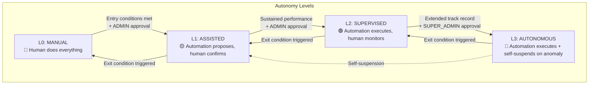
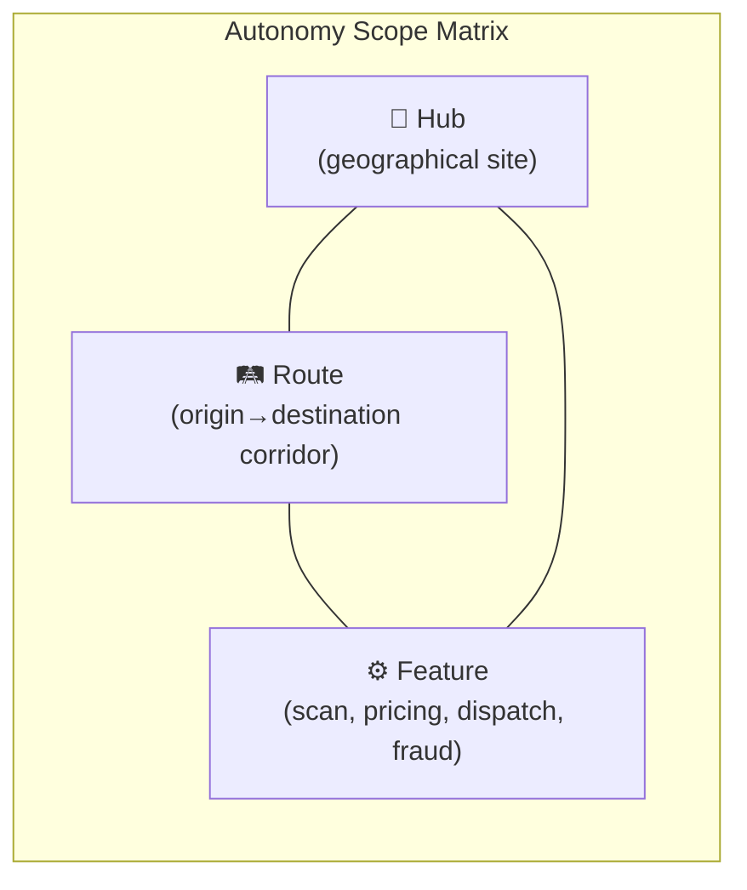
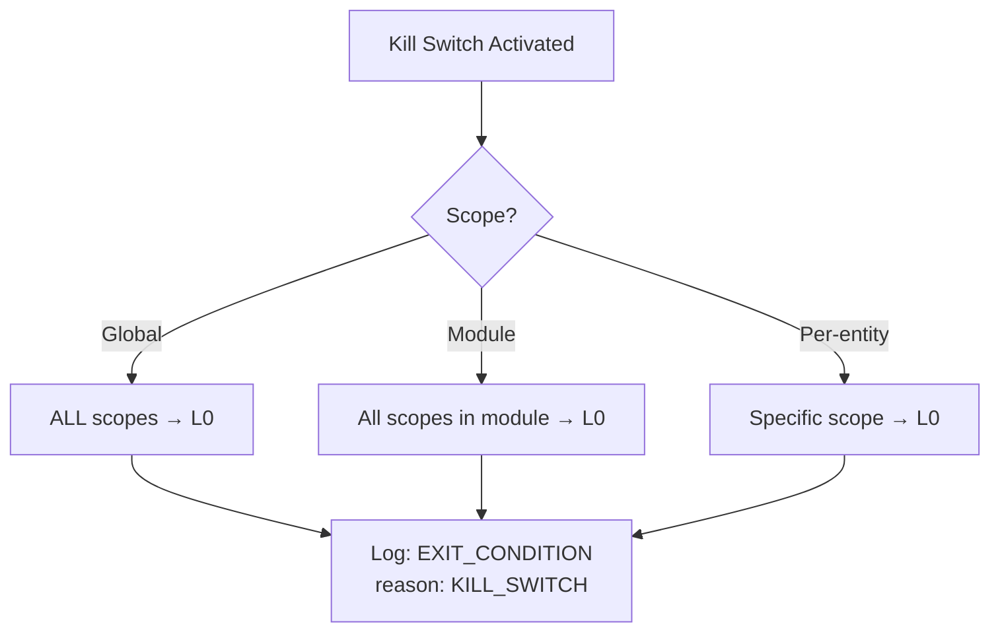
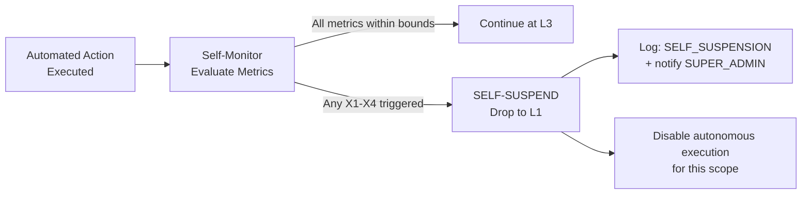
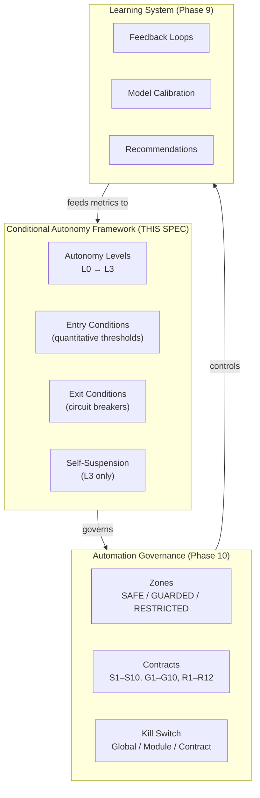

# TransLogistics — Conditional Autonomy Governance Specification

> **Version** : 1.0 — 2026-02-07
> **Author** : Lead Autonomy Architect
> **Status** : DRAFT — Pending Review
> **Prerequisites** : [AUTOMATION_GOVERNANCE_SPEC.md](file:///Users/user/Documents/DEVELOPPEMENTS/Projets/TransLogistics/docs/AUTOMATION_GOVERNANCE_SPEC.md), Phase 10 (Partial Automation), Phase 9 (Learning Loops), Phase 8 (Governance & Audit)

---

## 1. Executive Summary

This specification defines a **Conditional Autonomy Framework** that governs *how* and *when* individual automation scopes (hub, route, feature) can graduate between autonomy levels. It is a **governance layer above** the existing Automation Governance Spec (Zones + Contracts), adding:

- **Graduated autonomy levels** (L0→L3) with explicit behaviors
- **Per-scope autonomy tracking** (hub × route × feature matrix)
- **Quantitative entry conditions** (accuracy, override rate, margin stability)
- **Automatic exit conditions** (circuit-breakers that demote autonomy)
- **Self-suspension** at the highest level (L3)

### Core Invariant

> **Autonomy is always scoped, never global. Autonomy is always earned, never assumed. Autonomy is always reversible, never permanent.**



---

## 2. Autonomy Levels

### 2.1 Level Definitions

| Level | Name | Behavior | Human Role | Automation Role |
|:---:|:---|:---|:---|:---|
| **L0** | Manual | No automation. Human performs all operations. | Executor | None |
| **L1** | Assisted | Automation evaluates and **recommends**. Human **confirms** before execution. | Approver | Recommender |
| **L2** | Supervised | Automation **executes autonomously**. Human is **notified** and can override. | Monitor + Override | Executor + Reporter |
| **L3** | Autonomous | Automation executes and **self-monitors**. Self-suspends to L1 if anomaly detected. | Exception handler | Executor + Self-monitor |

### 2.2 Level Behaviors per Feature

| Feature | L0 | L1 | L2 | L3 |
|:---|:---|:---|:---|:---|
| **Scan Validation** | Operator validates every scan | AI proposes, operator confirms | AI validates if confidence ≥ threshold | AI validates + suspends hub if error rate spikes |
| **Pricing** | Admin sets all prices manually | System recommends price, admin approves | System applies within bounds, admin notified | System applies + rolls back if margin degrades |
| **Dispatch** | Dispatcher assigns all tasks | System suggests assignment, dispatcher confirms | System assigns opted-in drivers, dispatcher monitors | System assigns + suspends hub if failure rate spikes |
| **Fraud** | No automated detection | System flags, human investigates | System flags + disables auto-validation for hub | System flags + self-disables module on false-positive spike |

### 2.3 Level Invariants

| Invariant | Description |
|:---|:---|
| **No L3 without L2 track record** | A scope cannot jump from L0/L1 directly to L3 |
| **No global L3** | L3 is always per-hub, per-route, or per-feature — never platform-wide |
| **L3 self-suspension is non-negotiable** | If a self-suspension triggers, the scope drops to L1 (not L2) |
| **Human approval for promotion** | Every level increase requires explicit ADMIN (L0→L1, L1→L2) or SUPER_ADMIN (L2→L3) approval |
| **Automatic demotion, manual promotion** | Exit conditions trigger automatic demotion; re-promotion requires fresh approval |

---

## 3. Autonomy Scope

### 3.1 Scope Dimensions

Autonomy is tracked independently along **three dimensions**:



Each cell in the matrix has its own autonomy level:

| | Scan (S1) | Pricing (G4/R1) | Dispatch (G3) | Fraud (R2) |
|:---|:---:|:---:|:---:|:---:|
| **Hub Douala** | L2 | — | L1 | L0 |
| **Hub Abidjan** | L1 | — | L0 | L0 |
| **Route DLA→ABJ** | — | L1 | — | — |
| **Route ABJ→LOS** | — | L0 | — | — |

*"—" means not applicable (e.g., pricing is per-route, not per-hub)*

### 3.2 Scope Rules

| Rule | Description |
|:---|:---|
| **Feature determines scope type** | Scan & Dispatch → per-hub. Pricing → per-route. Fraud → per-hub or per-feature. |
| **No aggregated scope** | "All hubs at L2" is not a valid state — each hub has its own level |
| **Scope independence** | Hub Douala at L2 for Scan does not affect Hub Abidjan's level |
| **New hubs/routes start at L0** | Default level for any new entity is L0 (manual) |
| **Scope deactivation** | If a hub/route is deactivated, its autonomy level resets to L0 |

### 3.3 Data Model

```typescript
interface AutonomyScope {
    id: string;                         // UUID
    feature: 'SCAN' | 'PRICING' | 'DISPATCH' | 'FRAUD';
    scopeType: 'HUB' | 'ROUTE';
    scopeEntityId: string;              // hubId or routeId
    
    // Current state
    currentLevel: 0 | 1 | 2 | 3;
    levelChangedAt: Date;
    levelChangedBy: string;             // userId who approved
    levelChangeReason: string;
    
    // Entry performance snapshot at promotion time
    entrySnapshot: AutonomyEntrySnapshot;
    
    // Self-suspension state (L3 only)
    selfSuspended: boolean;
    selfSuspendedAt?: Date;
    selfSuspendedReason?: string;
    
    // History
    levelHistory: AutonomyLevelChange[];
}

interface AutonomyLevelChange {
    id: string;
    fromLevel: 0 | 1 | 2 | 3;
    toLevel: 0 | 1 | 2 | 3;
    changedAt: Date;
    changedBy: string;                  // userId or 'SYSTEM' for auto-demotion
    reason: string;
    trigger: 'PROMOTION' | 'DEMOTION' | 'SELF_SUSPENSION' | 'EXIT_CONDITION';
    evidence: Record<string, unknown>;  // Metrics that triggered the change
}
```

---

## 4. Autonomy Entry Conditions

### 4.1 Principle

> **A scope earns autonomy by demonstrating sustained, quantifiable performance above threshold with low human intervention.**

Entry conditions are **cumulative** — *all* conditions must be met simultaneously.

### 4.2 Entry Conditions: L0 → L1 (Manual → Assisted)

| # | Condition | Scan (S1) | Pricing (G4/R1) | Dispatch (G3) | Fraud (R2) |
|:---|:---|:---|:---|:---|:---|
| E1 | **Minimum sample size** | ≥ 50 scans processed | ≥ 20 pricing cycles | ≥ 30 dispatch events | ≥ 10 fraud signals evaluated |
| E2 | **Feature enabled globally** | `SCAN_AUTO_VALIDATION_ENABLED=true` | `PRICING_AUTO_APPLICATION_ENABLED=true` | `DISPATCH_AUTO_EXECUTION_ENABLED=true` | `FRAUD_AUTO_RESPONSE_ENABLED=true` |
| E3 | **ADMIN approval** | ADMIN approves for hub | ADMIN approves for route | ADMIN approves for hub | ADMIN approves |
| E4 | **No unresolved fraud alerts** | Hub has 0 OPEN fraud alerts | Route has 0 OPEN alerts | Hub has 0 OPEN alerts | N/A |

**Observation window:** 30 days minimum.

### 4.3 Entry Conditions: L1 → L2 (Assisted → Supervised)

| # | Condition | Scan (S1) | Pricing (G4/R1) | Dispatch (G3) | Fraud (R2) |
|:---|:---|:---|:---|:---|:---|
| E5 | **High accuracy** | AI confidence ≥ 85% on last 100 scans | Recommendation acceptance ≥ 80% | Assignment acceptance ≥ 90% | False positive rate ≤ 20% |
| E6 | **Low override rate** | Human overrides ≤ 5% of AI proposals | Admin rejects ≤ 10% of proposals | Dispatcher overrides ≤ 10% | Human escalation ≤ 15% |
| E7 | **Low error rate** | Historical correction rate ≤ 15% | Rollback rate ≤ 5% | Failed dispatch rate ≤ 5% | Missed fraud (false negatives) ≤ 5% |
| E8 | **Stable margins** | N/A | Route margin variance ≤ ±3% over 30 days | N/A | N/A |
| E9 | **Sustained L1 duration** | ≥ 30 days at L1 | ≥ 60 days at L1 | ≥ 30 days at L1 | ≥ 90 days at L1 |
| E10 | **ADMIN approval** | ADMIN confirms | ADMIN confirms | ADMIN confirms | ADMIN confirms |

### 4.4 Entry Conditions: L2 → L3 (Supervised → Autonomous)

| # | Condition | Scan (S1) | Pricing (G4/R1) | Dispatch (G3) | Fraud (R2) |
|:---|:---|:---|:---|:---|:---|
| E11 | **Excellent accuracy** | AI confidence ≥ 92% over 500 scans | Acceptance ≥ 90% over 100 cycles | Acceptance ≥ 95% over 200 events | FP rate ≤ 10% over 50 signals |
| E12 | **Near-zero override** | Overrides ≤ 2% | Rejects ≤ 3% | Overrides ≤ 3% | Escalation ≤ 5% |
| E13 | **Stable performance** | Error rate ≤ 10% for 90 consecutive days | Margin within ±2% for 90 days | Failure rate ≤ 2% for 60 days | FN rate ≤ 3% for 90 days |
| E14 | **No demotion history** | No demotion in last 90 days | No demotion in last 180 days | No demotion in last 90 days | No demotion in last 180 days |
| E15 | **Self-suspension tested** | Self-suspension logic unit-tested | Rollback mechanism tested | Cancel override tested | Module self-disable tested |
| E16 | **SUPER_ADMIN approval** | **Required** | **Required** | **Required** | **Required** |

### 4.5 Entry Snapshot

At each promotion, the system captures a performance snapshot:

```typescript
interface AutonomyEntrySnapshot {
    capturedAt: Date;
    sampleSize: number;
    accuracy: number;           // % correct decisions
    overrideRate: number;       // % human overrides
    errorRate: number;          // % errors or corrections
    marginVariance?: number;    // For pricing only
    fraudAlertCount: number;    // Open alerts at time of promotion
    daysAtPreviousLevel: number;
}
```

---

## 5. Autonomy Exit Conditions (Circuit Breakers)

### 5.1 Principle

> **Exit conditions trigger automatically. Demotion is instant. Re-promotion requires fresh evidence and human approval.**

### 5.2 Exit Conditions: L3 → L1 (Self-Suspension)

Self-suspension drops to **L1** (not L2), requiring human re-engagement.

| # | Condition | Scan (S1) | Pricing (G4/R1) | Dispatch (G3) | Fraud (R2) |
|:---|:---|:---|:---|:---|:---|
| X1 | **Error spike** | Error rate > 20% over 24h window | Rollback triggered | Failure rate > 10% over 24h | False positive rate > 40% over 24h |
| X2 | **Fraud signal on scope** | OPEN fraud alert on hub | OPEN fraud alert on route | OPEN fraud alert on hub | N/A |
| X3 | **Anomaly detection** | Confidence drop > 15 percentage points vs entry snapshot | Margin deviation > 5% from entry | Override spike > 3× baseline | Signal volume spike > 5× baseline |
| X4 | **Consecutive failures** | 3 consecutive incorrect validations | 2 consecutive rollbacks | 3 consecutive failed dispatches | 3 consecutive false positives |

### 5.3 Exit Conditions: L2 → L1 (Demotion)

| # | Condition | Threshold | Window |
|:---|:---|:---|:---|
| X5 | **Override rate exceeds threshold** | > 15% overrides | 7-day rolling window |
| X6 | **Error rate exceeds threshold** | > 25% errors | 7-day rolling window |
| X7 | **Margin instability** (pricing only) | Variance > ±5% | 14-day rolling window |
| X8 | **Human intervention requested** | Admin explicitly demotes | Immediate |
| X9 | **Kill switch activated** | Module or global kill switch pulled | Immediate — drops ALL scopes to L0 |

### 5.4 Exit Conditions: L1 → L0 (Full Demotion)

| # | Condition | Threshold |
|:---|:---|:---|
| X10 | **Feature disabled globally** | Env var set to `false` |
| X11 | **Hub/route deactivated** | Entity no longer active |
| X12 | **ADMIN explicit demotion** | Admin removes from automation |
| X13 | **Sustained poor performance** | Override rate > 50% for 14+ days at L1 |

### 5.5 Kill Switch Interaction



> [!CAUTION]
> Kill switch demotion to L0 is **permanent** until manual re-promotion. This prevents oscillation between levels during incidents.

---

## 6. Self-Suspension Mechanism (L3)

### 6.1 Architecture

L3 scopes run a **self-monitoring loop** that evaluates exit conditions after every automated action.



### 6.2 Self-Suspension Rules

| Rule | Description |
|:---|:---|
| **Evaluation frequency** | After every action execution (synchronous, not batched) |
| **Metric window** | Rolling 24-hour window for rate calculations |
| **Suspension target** | Always L1 — never L2 (forces human re-engagement) |
| **Notification** | SUPER_ADMIN notified within 60 seconds |
| **Recovery** | Requires SUPER_ADMIN to manually re-promote to L2, then L3 |
| **Audit** | `AutonomyLevelChange` with `trigger: SELF_SUSPENSION` |

### 6.3 Self-Suspension per Feature

| Feature | Self-Suspension Trigger | Automated Action on Suspension |
|:---|:---|:---|
| **Scan** | Error rate > 20% (24h) or 3 consecutive mis-validations | Disable auto-validation for hub; queue scans for manual review |
| **Pricing** | Rollback triggered or margin deviation > 5% | Rollback latest auto-applied rule; pause recommendations |
| **Dispatch** | 3 consecutive task failures or failure rate > 10% (24h) | Cancel pending auto-assignments; revert to manual queue |
| **Fraud** | False positive rate > 40% (24h) or 3 consecutive FPs | Disable auto-response; keep alerts but require manual triage |

---

## 7. Autonomy Decision Log

### 7.1 Principle

> **Every autonomy level change — promotion, demotion, or self-suspension — is logged with full evidence chain.**

### 7.2 Log Schema

```typescript
interface AutonomyDecisionLog {
    id: string;                          // UUID
    scopeId: string;                     // AutonomyScope.id
    feature: string;
    scopeType: string;
    scopeEntityId: string;
    
    // Change
    fromLevel: number;
    toLevel: number;
    trigger: 'PROMOTION' | 'DEMOTION' | 'SELF_SUSPENSION' | 'EXIT_CONDITION' | 'KILL_SWITCH';
    
    // Evidence
    reason: string;                      // Human-readable explanation
    entrySnapshot?: AutonomyEntrySnapshot;  // For promotions
    exitMetrics?: {                      // For demotions
        metricName: string;
        currentValue: number;
        threshold: number;
        window: string;                  // e.g., "24h", "7d"
    }[];
    
    // Approval
    approvedBy?: string;                 // For promotions
    approvalRole?: 'ADMIN' | 'SUPER_ADMIN';
    
    // Metadata
    timestamp: Date;
    contractId: string;                  // Related automation contract
}
```

### 7.3 Log Retention

| Type | Retention |
|:---|:---|
| Promotion logs | 3 years (financial traceability) |
| Demotion logs | 3 years |
| Self-suspension logs | 3 years |
| Kill switch logs | Permanent |

---

## 8. Relationship to Existing Systems

### 8.1 Layer Architecture



### 8.2 Zone ↔ Level Mapping

The existing zones define *what security controls apply*. Autonomy levels define *how much human involvement is required*. They are orthogonal:

| | Zone SAFE | Zone GUARDED | Zone RESTRICTED |
|:---|:---:|:---:|:---:|
| **L0** | Human executes safe tasks | Human executes guarded tasks | Human executes restricted tasks |
| **L1** | System proposes, human confirms | System proposes + notifies | System proposes, two-person approval |
| **L2** | System executes silently | System executes + notifies + retractable | Not permitted (RESTRICTED always needs approval) |
| **L3** | System executes + self-monitors | System executes + self-suspends | **Never permitted** |

> [!IMPORTANT]
> **RESTRICTED zone actions (R1–R12) can never exceed L1.** They always require explicit human approval. This is a hard constraint, not configurable.

### 8.3 Integration with Phase 10 Services

| Service | Current Implementation | Autonomy Level Mapping |
|:---|:---|:---|
| `ScanAutoValidationService` | 5-gate pipeline, per-hub config | L0: all manual. L1: evaluate returns recommendation. L2: auto-validates above threshold. L3: auto-validates + self-suspends on error spike. |
| `PricingAutoApplicationService` | 6-gate pipeline, rollback | L0: manual pricing. L1: recommends, admin approves. L2: applies within bounds. L3: applies + rolls back on margin deviation. |
| `DispatchAutoExecutionService` | 5-gate pipeline, override | L0: manual dispatch. L1: suggests assignment. L2: auto-assigns opted-in drivers. L3: auto-assigns + self-suspends on failure spike. |
| `FraudResponseService` | 3-gate pipeline, soft actions only | L0: no detection. L1: flags and notifies. L2: flags + disables auto-validation. L3: responds + self-disables on FP spike. |

---

## 9. Governance Summary

### 9.1 What Prevents Runaway Automation

| Guardrail | Mechanism |
|:---|:---|
| **No global autonomy** | Autonomy is per-hub, per-route, per-feature — never platform-wide |
| **Earned, not assumed** | Quantitative entry conditions with minimum observation windows |
| **Automatic demotion** | Exit conditions trigger instantly; no human delay |
| **Self-suspension drops to L1** | Forces human re-engagement, not just monitoring |
| **RESTRICTED zone cap** | R-zone actions can never exceed L1, regardless of performance |
| **Kill switch → L0** | Emergency stop resets to full manual, requiring fresh promotion |
| **Full audit trail** | Every level change logged with evidence and approval chain |
| **No oscillation** | Demotion disqualifies re-promotion for 90-180 days |

### 9.2 What Enables Progressive Trust

| Enabler | Mechanism |
|:---|:---|
| **Graduated levels** | Small, reversible steps from L0 to L3 |
| **Quantitative evidence** | Promotion based on measurable accuracy, not subjective assessment |
| **Per-scope granularity** | Proven hubs advance independently of new hubs |
| **Learning integration** | Phase 9 feedback improves models → improves entry metrics → enables promotion |
| **Admin visibility** | Control Panel shows current level per scope with promotion/demotion history |

---

## 10. Readiness Assessment

### 10.1 Current State vs. Framework Requirements

| Requirement | Phase 10 Status | Gap |
|:---|:---|:---|
| Per-hub/route configs | ✅ Prisma models exist | None |
| Accuracy tracking | ✅ `computeHistoricalErrorRate()` | Need rolling window aggregation |
| Override tracking | ⚠️ Audit logs exist but not aggregated | Need override rate metric |
| Kill switch | ✅ Runtime toggle + control panel | Need persistent DB state (not process.env) |
| Rollback | ✅ Pricing has transactional rollback | None |
| Self-suspension | ⚠️ Not yet implemented | Requires L3 monitoring loop |
| Autonomy scope model | ❌ Not yet in schema | Requires new Prisma model |
| Entry/exit evaluation | ❌ Not yet implemented | Requires evaluation service |
| Decision log | ⚠️ AuditLog exists but not typed for autonomy | Requires typed log entries |

### 10.2 Implementation Priority

| Priority | Item | Effort |
|:---|:---|:---|
| **P0** | `AutonomyScope` Prisma model + migration | 1 day |
| **P0** | `AutonomyEvaluationService` (entry/exit condition checker) | 2 days |
| **P1** | Override rate + error rate metric aggregation | 1 day |
| **P1** | Control Panel: autonomy level display per scope | 1 day |
| **P2** | Self-suspension monitoring loop (L3) | 2 days |
| **P2** | Persistent kill switch (DB-backed) | 1 day |
| **P3** | Promotion workflow with approval UI | 2 days |

---

## 11. Glossary

| Term | Definition |
|:---|:---|
| **Autonomy Level** | Degree of independent operation permitted for a scope (L0–L3) |
| **Autonomy Scope** | Intersection of feature × entity (e.g., "Scan for Hub Douala") |
| **Entry Condition** | Quantitative threshold that must be met for promotion |
| **Exit Condition** | Metric breach that triggers automatic demotion |
| **Self-Suspension** | L3 capability to demote itself to L1 when anomalies detected |
| **Promotion** | Increase in autonomy level, requiring human approval + evidence |
| **Demotion** | Decrease in autonomy level, triggered automatically or by admin |
| **Circuit Breaker** | Automatic demotion mechanism that prevents cascading failures |
| **Entry Snapshot** | Performance metrics captured at the moment of promotion |
| **Observation Window** | Minimum time a scope must spend at a level before promotion |
