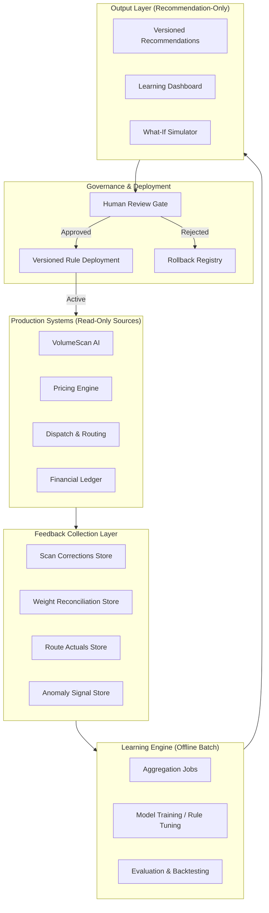
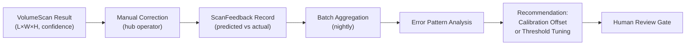
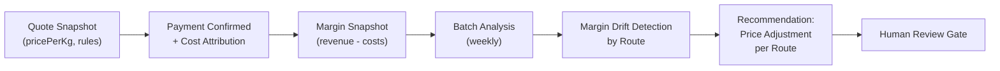
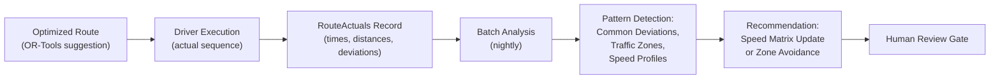
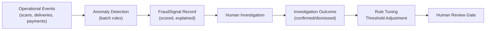
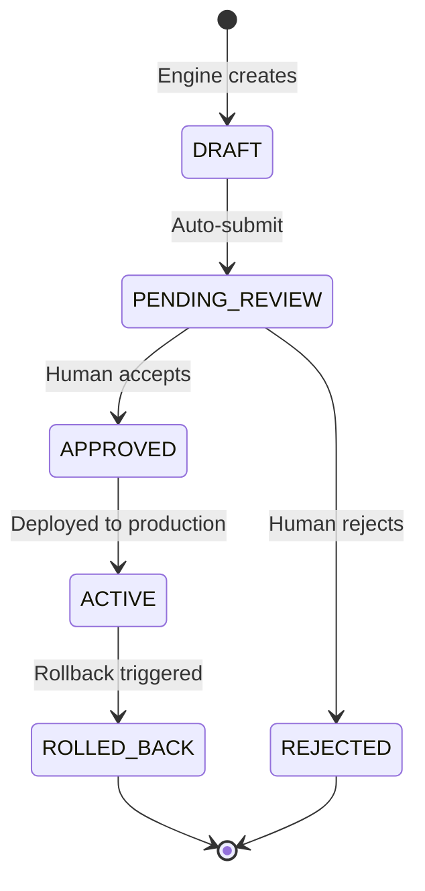

# TransLogistics – Continuous Learning Framework Specification

> **Version**: 1.0 — 2026-02-07
> **Author**: Lead Learning System Architect
> **Status**: DRAFT — Pending Review

---

## 1. Executive Summary

This specification defines a **Continuous Learning Framework** for the TransLogistics platform. The system captures real-world operational feedback, processes it in batch, and surfaces **explainable recommendations** that human operators may accept or reject. It introduces **no self-modifying production logic** and **no black-box decisions**. Every learning output is versioned, auditable, and rollback-safe.

> [!IMPORTANT]
> The Learning Framework operates in **advisory mode only**. No production behavior changes without explicit human approval and a versioned rule deployment.

---

## 2. Architecture Overview



### 2.1 Core Principles

| Principle | Enforcement |
|:---|:---|
| **No silent behavior change** | All model/rule updates go through `REVIEW` gate |
| **Versioned models & rules** | Every artifact carries `version`, `createdAt`, `parentVersion` |
| **Rollback always possible** | `LearningRuleVersion` stores previous state; revert is atomic |
| **Explainability** | Every recommendation includes `reasoning[]` and `evidence{}` |
| **Immutable audit trail** | Learning decisions logged in append-only `LearningDecisionLog` |

---

## 3. Learning Loops

### 3.1 Loop 1 — Scan Accuracy Improvement

**Goal**: Reduce VolumeScan dimension error from ±10% to ±5%.



| Attribute | Value |
|:---|:---|
| **Feedback Source** | `ScanCorrection` — manual override with actual dimensions |
| **Metric** | Mean Absolute Error (MAE) per dimension (L, W, H) |
| **Segmentation** | By hub, by package-size category, by lighting conditions |
| **Output** | Calibration offset table, updated confidence thresholds |
| **Automation Level** | **Recommendation-only** — operator must accept new calibration |

#### Data Contract: `ScanFeedback`
```typescript
interface ScanFeedback {
  id: string;
  scanResultId: string;            // FK → ScanResult
  shipmentId: string;              // FK → Shipment
  hubId: string;                   // Where correction was made
  // Predicted (AI)
  predictedLengthCm: Decimal;
  predictedWidthCm: Decimal;
  predictedHeightCm: Decimal;
  predictedConfidence: number;
  modelVersion: string;            // e.g. "volumescan-v1.2"
  // Actual (Human)
  actualLengthCm: Decimal;
  actualWidthCm: Decimal;
  actualHeightCm: Decimal;
  measurementMethod: 'SCALE' | 'TAPE' | 'CALIBRATED_BOX';
  // Metadata
  correctedByUserId: string;
  correctedAt: DateTime;
  notes?: string;
}
```

#### Learning Output: `ScanCalibrationRecommendation`
```typescript
interface ScanCalibrationRecommendation {
  id: string;
  version: string;                 // Semantic version
  parentVersion?: string;          // Previous active version
  status: 'DRAFT' | 'PENDING_REVIEW' | 'APPROVED' | 'REJECTED' | 'ROLLED_BACK';
  // Recommended changes
  confidenceThreshold: number;     // e.g. 0.70 → 0.75
  calibrationOffsets: {
    hubId: string;
    lengthBiasCm: Decimal;         // Systematic correction
    widthBiasCm: Decimal;
    heightBiasCm: Decimal;
  }[];
  // Evidence
  sampleSize: number;
  maeBefore: { L: number; W: number; H: number };
  maeAfter: { L: number; W: number; H: number };  // Backtested
  reasoning: string[];
  evaluationPeriod: { from: Date; to: Date };
  createdAt: DateTime;
}
```

---

### 3.2 Loop 2 — Pricing & Margin Optimization

**Goal**: Optimize pricing rules to maintain target margins per route while staying competitive.



| Attribute | Value |
|:---|:---|
| **Feedback Sources** | `RoutePerformanceSnapshot`, `RouteCostEntry`, `Payment`, `Quote` |
| **Metric** | Gross Margin % per route, Revenue per kg, Cost per delivery |
| **Segmentation** | By route, by service type, by weight class |
| **Output** | Pricing rule change proposals with projected margin impact |
| **Automation Level** | **Recommendation-only** — commercial team validates pricing |

#### Data Contract: `MarginAnalysisInput`
```typescript
interface MarginAnalysisInput {
  routeId: string;
  periodStart: Date;
  periodEnd: Date;
  // Aggregated from snapshots
  totalRevenue: Decimal;
  totalCosts: Decimal;           // From CostAttribution
  costBreakdown: {
    category: 'FUEL' | 'WAGES' | 'CUSTOMS' | 'HANDLING' | 'OTHER';
    amount: Decimal;
    assumptionLevel: 'ACTUAL' | 'ESTIMATED' | 'DEFAULT';
  }[];
  shipmentCount: number;
  totalWeightKg: Decimal;
  averageDeliveryDays: number;
}
```

#### Learning Output: `PricingRecommendation`
```typescript
interface PricingRecommendation {
  id: string;
  version: string;
  status: 'DRAFT' | 'PENDING_REVIEW' | 'APPROVED' | 'REJECTED';
  recommendations: {
    routeId: string;
    routeName: string;
    currentPricePerKg: Decimal;
    recommendedPricePerKg: Decimal;
    changePercent: number;
    projectedMarginPercent: number;
    reasoning: string;             // "Fuel costs increased 12% on ABJ→BKE route..."
  }[];
  globalMetrics: {
    currentAvgMargin: number;
    projectedAvgMargin: number;
  };
  evidence: {
    analysisWindow: { from: Date; to: Date };
    sampleSize: number;
    dataCompleteness: number;      // % of routes with ACTUAL costs
  };
  createdAt: DateTime;
}
```

---

### 3.3 Loop 3 — Routing Efficiency Improvement

**Goal**: Improve route sequence recommendations to reduce total delivery time by 15%.



| Attribute | Value |
|:---|:---|
| **Feedback Sources** | `RoutePlan` execution data, driver GPS traces, `DeliveryProof` timestamps |
| **Metric** | Estimated vs Actual duration, deviation rate from suggested order |
| **Segmentation** | By hub zone, by time-of-day, by vehicle type |
| **Output** | Urban speed profile tables, zone penalty weights |
| **Automation Level** | **Gradual** — speed profiles auto-update after 30-day approval window |

#### Data Contract: `RouteExecutionFeedback`
```typescript
interface RouteExecutionFeedback {
  routePlanId: string;
  driverId: string;
  vehicleType: 'MOTO' | 'TRICYCLE' | 'VAN';
  hubId: string;
  planDate: Date;
  // Planned
  estimatedDurationMinutes: number;
  estimatedDistanceKm: Decimal;
  suggestedStopOrder: string[];    // DispatchTask IDs in OR-Tools order
  // Actual
  actualDurationMinutes: number;
  actualDistanceKm?: Decimal;      // From GPS trace if available
  actualStopOrder: string[];       // DispatchTask IDs in execution order
  // Per-stop actuals
  stopActuals: {
    dispatchTaskId: string;
    estimatedArrivalMinutes: number;
    actualArrivalMinutes: number;
    dwellTimeMinutes: number;      // Time at stop (loading, waiting, proof)
    coordinateQuality: 'GPS' | 'APPROXIMATE' | 'LANDMARK';
  }[];
  // Conditions
  weatherCondition?: 'DRY' | 'RAIN' | 'HARMATTAN';
  dayOfWeek: number;
  startHour: number;
}
```

#### Learning Output: `RoutingModelUpdate`
```typescript
interface RoutingModelUpdate {
  id: string;
  version: string;
  parentVersion?: string;
  status: 'DRAFT' | 'PENDING_REVIEW' | 'APPROVED' | 'ACTIVE' | 'ROLLED_BACK';
  // Updated parameters
  speedProfiles: {
    zoneId: string;                // Geographic cluster
    vehicleType: 'MOTO' | 'TRICYCLE' | 'VAN';
    timeSlot: 'MORNING' | 'MIDDAY' | 'AFTERNOON' | 'EVENING';
    avgSpeedKmh: number;          // Replaces the static 25 km/h
    confidence: number;
    sampleSize: number;
  }[];
  zonePenalties: {
    zoneId: string;
    penaltyFactor: number;        // Multiplier (1.0 = no penalty, 1.5 = 50% slower)
    reason: string;               // "Market day congestion, Tuesdays 10-14h"
  }[];
  // Backtesting
  backtest: {
    historicalRoutes: number;
    estimationErrorBefore: number; // Mean % error
    estimationErrorAfter: number;  // Projected % error
  };
  approvalDeadline: Date;         // Auto-activates after 30 days if no rejection
  createdAt: DateTime;
}
```

---

### 3.4 Loop 4 — Fraud Signal Refinement

**Goal**: Detect and flag suspicious patterns (weight manipulation, phantom deliveries, collusive pricing).



| Attribute | Value |
|:---|:---|
| **Feedback Sources** | Investigation outcomes (`CONFIRMED_FRAUD`, `FALSE_POSITIVE`, `INCONCLUSIVE`) |
| **Metric** | Precision (reduce false positives), Recall (catch real fraud) |
| **Segmentation** | By fraud type, by hub, by user role |
| **Output** | Adjusted detection thresholds, new pattern rules |
| **Automation Level** | **Recommendation-only** — fraud rules always require human approval |

#### Fraud Signal Types

| Signal ID | Description | Detection Logic |
|:---|:---|:---|
| `WEIGHT_MISMATCH` | Declared ≪ AI-scanned weight | `abs(declared - scanned) / scanned > 0.30` |
| `REPEATED_MANUAL_OVERRIDE` | Same operator always overrides AI | `overrideCount / totalScans > 0.50` on rolling 7d |
| `PHANTOM_DELIVERY` | Delivery proof GPS far from destination | `haversine(proofGPS, destGPS) > 500m` |
| `ABNORMAL_DWELL` | Suspiciously short dwell at delivery | `dwellTimeMinutes < 1 AND proofType = SIGNATURE` |
| `MARGIN_ANOMALY` | Route margin deviates significantly | `routeMargin < (avgMargin - 2σ)` |

#### Data Contract: `FraudSignal`
```typescript
interface FraudSignal {
  id: string;
  signalType: string;              // From Signal ID table
  severity: 'LOW' | 'MEDIUM' | 'HIGH' | 'CRITICAL';
  score: number;                   // 0.0 – 1.0
  // Context
  entityType: 'SHIPMENT' | 'SCAN' | 'DELIVERY' | 'PAYMENT' | 'USER';
  entityId: string;
  hubId?: string;
  userId?: string;                 // Suspect actor
  // Explainability
  reasoning: string;               // Human-readable explanation
  evidence: Record<string, unknown>; // Raw data points
  thresholdUsed: number;           // The threshold that was exceeded
  ruleVersion: string;             // Which version of the rule
  // Resolution
  investigationStatus: 'OPEN' | 'INVESTIGATING' | 'CONFIRMED' | 'DISMISSED';
  investigatedByUserId?: string;
  investigationNotes?: string;
  resolvedAt?: DateTime;
  detectedAt: DateTime;
}
```

---

## 4. Feedback Sources — Consolidated Registry

| Source | Origin | Collection Mode | Frequency | Storage |
|:---|:---|:---|:---|:---|
| **Manual Scan Corrections** | Hub operator overrides AI scan | Event-driven (on override) | Real-time capture | `ScanFeedback` |
| **Billed Weight vs Delivered** | Destination hub re-weighs | Event-driven (at hub check-in) | Per shipment | `WeightReconciliation` |
| **Route Actual vs Estimated** | Driver app GPS + timestamps | Sync on route completion | Per route plan | `RouteExecutionFeedback` |
| **Margin Snapshots by Route** | Analytics pipeline aggregation | Batch (nightly cron at 02:00) | Daily | `RoutePerformanceSnapshot` |
| **Delivery Proof Quality** | GPS distance + dwell time | Event-driven (on proof capture) | Per delivery | `DeliveryProof` (existing) |
| **Fraud Investigation Outcomes** | Operations team resolution | Manual entry | Per investigation | `FraudSignalResolution` |

### 4.1 Collection Principles

1. **Passive capture**: Feedback is a natural byproduct of operations, not an extra step
2. **Non-blocking**: Feedback recording never delays the primary workflow
3. **Immutable**: Once recorded, feedback records are never modified — only appended with resolutions
4. **Tagged**: Every feedback record references the model/rule version active at the time

---

## 5. Learning Modes

### 5.1 Mode A — Offline Batch Learning

The **primary** and **safest** learning mode. All analysis happens outside the request path.

```
┌───────────────────────────────────────────────────┐
│  PRODUCTION DATABASE (read replica)               │
│  ├── ScanFeedback                                 │
│  ├── RouteExecutionFeedback                       │
│  ├── RoutePerformanceSnapshot                     │
│  └── FraudSignal                                  │
└──────────────────┬────────────────────────────────┘
                   │ nightly / weekly batch
                   ▼
┌───────────────────────────────────────────────────┐
│  LEARNING ENGINE (isolated process)               │
│  ├── ScanAccuracyAnalyzer                         │
│  ├── MarginDriftDetector                          │
│  ├── RouteEfficiencyAnalyzer                      │
│  └── FraudPatternRefiner                          │
└──────────────────┬────────────────────────────────┘
                   │ writes to
                   ▼
┌───────────────────────────────────────────────────┐
│  RECOMMENDATION STORE (write-only by engine)      │
│  ├── ScanCalibrationRecommendation                │
│  ├── PricingRecommendation                        │
│  ├── RoutingModelUpdate                           │
│  └── FraudRuleProposal                            │
└───────────────────────────────────────────────────┘
```

| Parameter | Value |
|:---|:---|
| **Schedule** | Scan: nightly, Pricing: weekly (Sunday 04:00), Routing: nightly, Fraud: nightly |
| **Data Source** | Read replica or snapshot — never the primary transactional DB |
| **Compute** | Isolated process/container — no shared resources with API |
| **Timeout** | Max 30 minutes per batch job |
| **Idempotency** | Clear-and-replace for the analysis period (same as analytics pipeline) |

### 5.2 Mode B — Recommendation-Only Outputs

All learning outputs are **suggestions**. The system never modifies production rules directly.



**Display**: Recommendations surface in the **Learning Dashboard** (extension of existing Analytics Dashboard) with:
- Side-by-side comparison (current vs proposed)
- Backtesting results
- Confidence scores
- Full evidence trail

### 5.3 Mode C — Gradual Automation with Thresholds

For **low-risk, high-confidence** recommendations only. Reserved for routing speed profiles.

| Criterion | Threshold |
|:---|:---|
| **Minimum sample size** | ≥ 100 route executions |
| **Confidence** | ≥ 0.90 |
| **Change magnitude** | ≤ 15% from current value |
| **Approval window** | 30 calendar days (auto-activates if no rejection) |
| **Rollback trigger** | Estimation error increases > 5% in first 7 days |

> [!CAUTION]
> Gradual automation is **disabled by default**. It must be explicitly enabled per hub by a SUPER_ADMIN with audit logging.

---

## 6. Safety Rules & Governance

### 6.1 Invariant Safety Rules

| Rule | Mechanism |
|:---|:---|
| **No silent behavior change** | Production rules can only change via `LearningRuleDeployment` with `approvedByUserId` |
| **Versioned models & rules** | Every active rule/model has `version`, `activatedAt`, `deactivatedAt` |
| **Rollback always possible** | `LearningRuleVersion` stores full previous state; rollback is a single atomic transaction |
| **No self-modifying production logic** | Learning Engine writes to `Recommendation Store` only; never to `PricingRule`, `ScanConfig`, etc. |
| **No black-box decisions** | Every recommendation includes `reasoning[]` array and `evidence{}` payload |
| **Learning is explainable** | Outputs are deterministic rule adjustments or threshold changes, not opaque neural weights |

### 6.2 Governance Data Model

```typescript
interface LearningRuleDeployment {
  id: string;
  ruleType: 'SCAN_CALIBRATION' | 'PRICING_RULE' | 'SPEED_PROFILE' | 'FRAUD_THRESHOLD';
  recommendationId: string;        // FK → the recommendation that generated this
  version: string;
  previousVersion?: string;
  // Deployment
  deployedAt: DateTime;
  deployedByUserId: string;        // Must be ADMIN or SUPER_ADMIN
  // State snapshot (for rollback)
  previousState: JsonValue;        // Complete serialized previous configuration
  newState: JsonValue;             // Complete serialized new configuration
  // Lifecycle
  status: 'ACTIVE' | 'ROLLED_BACK' | 'SUPERSEDED';
  rolledBackAt?: DateTime;
  rolledBackByUserId?: string;
  rollbackReason?: string;
}

interface LearningDecisionLog {
  id: string;
  // Immutable, append-only
  action: 'RECOMMENDATION_CREATED' | 'REVIEW_STARTED' | 'APPROVED'
        | 'REJECTED' | 'DEPLOYED' | 'ROLLBACK_INITIATED' | 'ROLLBACK_COMPLETED';
  ruleType: string;
  recommendationId: string;
  performedByUserId?: string;      // null for system-generated actions
  reason?: string;
  metadata: JsonValue;
  createdAt: DateTime;             // No updatedAt — immutable
}
```

### 6.3 Access Control

| Action | Required Role | Audit |
|:---|:---|:---|
| View recommendations | `OPERATOR`, `ADMIN`, `SUPER_ADMIN` | Read log |
| Approve/Reject recommendation | `ADMIN`, `SUPER_ADMIN` | `LearningDecisionLog` entry |
| Deploy to production | `SUPER_ADMIN` only | `LearningRuleDeployment` + `LearningDecisionLog` |
| Trigger rollback | `ADMIN`, `SUPER_ADMIN` | `LearningDecisionLog` + revert entry |
| Enable gradual automation | `SUPER_ADMIN` only | `LearningDecisionLog` entry |

### 6.4 Monitoring & Circuit Breakers

| Monitor | Trigger | Action |
|:---|:---|:---|
| **Scan MAE spike** | MAE increases > 20% vs previous week | Auto-freeze calibration, alert ADMIN |
| **Margin crash** | Any route margin drops below 0% for 3 consecutive days | Flag for immediate review |
| **Route estimation drift** | Mean estimation error > 40% for 48h | Rollback latest speed profile |
| **Fraud false-positive rate** | FP rate > 60% over rolling 30 days | Freeze fraud thresholds, alert |
| **Batch job failure** | Any learning job fails 3 consecutive runs | Disable job, alert ops team |

---

## 7. Technical Integration Points

### 7.1 With Existing Platform Services

| Existing Service | Integration Type | Learning Role |
|:---|:---|:---|
| `ScanService` | Event emitter → `ScanFeedback` | Provides predicted vs actual data |
| `PricingService` | Read-only consumer | Receives approved `PricingRecommendation` |
| `RouteOptimizationService` | Parameter consumer | Reads active `SpeedProfile` version |
| `DispatchTaskService` | Event emitter → `RouteExecutionFeedback` | Records actual execution data |
| `DeliveryProofService` | Event emitter → fraud signals | GPS proximity triggers |
| `AnalyticsAggregationService` | Data provider | Supplies `RoutePerformanceSnapshot` |
| `CostAttributionService` | Data provider | Supplies margin data with assumption flags |

### 7.2 New Infrastructure

| Component | Technology | Deployment |
|:---|:---|:---|
| **Learning Engine** | Node.js batch process (BullMQ jobs) | Separate worker process |
| **Recommendation Store** | PostgreSQL tables (same DB, `learning_` prefix) | Prisma schema extension |
| **Learning Dashboard** | Next.js pages (Analytics extension) | `apps/web/src/app/dashboard/learning/` |
| **Batch Scheduler** | `cron` library (same as analytics) | `learning.cron.ts` |

---

## 8. Implementation Phases

### Phase L1 — Feedback Collection (Foundation)
- Add `ScanFeedback` + `WeightReconciliation` Prisma models
- Add `RouteExecutionFeedback` capture to `RoutePlanService.complete()`
- Add override tracking to `ScanService`
- **No learning outputs** — data collection only

### Phase L2 — Scan Accuracy Loop
- Implement `ScanAccuracyAnalyzer` batch job
- Build calibration recommendation pipeline
- Add Learning Dashboard (scan accuracy view)
- Implement review/approve/reject workflow

### Phase L3 — Pricing & Margin Loop
- Implement `MarginDriftDetector` batch job
- Build pricing recommendation pipeline
- Extend dashboard with margin views
- Integrate with `PricingRule` versioning

### Phase L4 — Routing Loop
- Implement `RouteEfficiencyAnalyzer` batch job
- Build speed profile recommendation pipeline
- Implement gradual automation with 30-day window
- Replace static 25 km/h with zone-based profiles

### Phase L5 — Fraud Detection
- Implement anomaly detection rules
- Build investigation workflow UI
- Feedback loop for threshold tuning
- Circuit breakers and alerting

---

## 9. Success Metrics

| Metric | Baseline (Current) | Target (6 months) | Measurement |
|:---|:---|:---|:---|
| Scan dimension MAE | ±10% | ±5% | `ScanFeedback` aggregate |
| Manual override rate | Unknown | < 15% | `ScanResult.weightSource` distribution |
| Average route margin | Unknown | +5pp from baseline | `RoutePerformanceSnapshot` |
| Route estimation error | ~40% (static 25 km/h) | < 20% | `RouteExecutionFeedback` aggregate |
| Fraud false-positive rate | N/A | < 30% | `FraudSignal` resolution outcomes |
| Time-to-recommendation | N/A | < 24h from data availability | Batch job completion timestamps |

---

## 10. Glossary

| Term | Definition |
|:---|:---|
| **Learning Loop** | A closed cycle: collect feedback → analyze → recommend → review → deploy |
| **Recommendation** | A versioned, explainable suggestion to change a production parameter |
| **Gradual Automation** | Time-boxed auto-deployment with rollback triggers |
| **Circuit Breaker** | Automatic freeze triggered by metric degradation |
| **Backtesting** | Applying proposed changes to historical data to project outcomes |
| **Rule Deployment** | The atomic act of replacing a production parameter with an approved recommendation |
