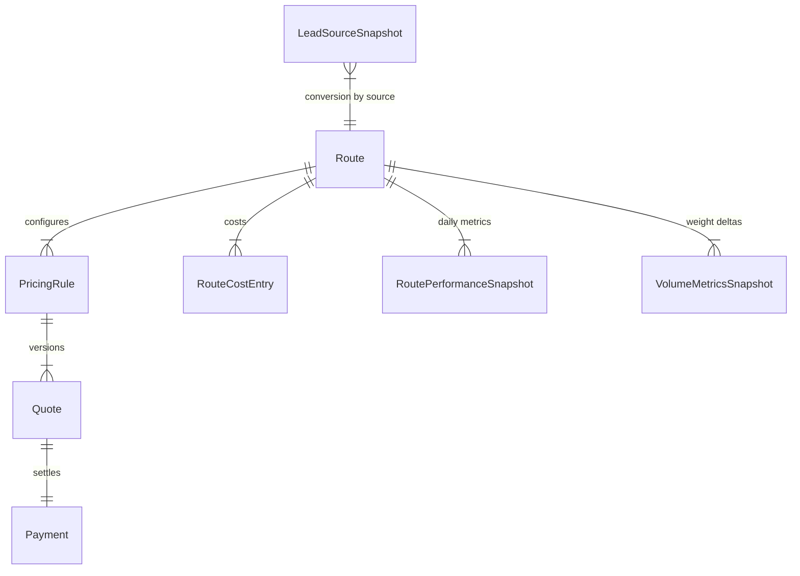
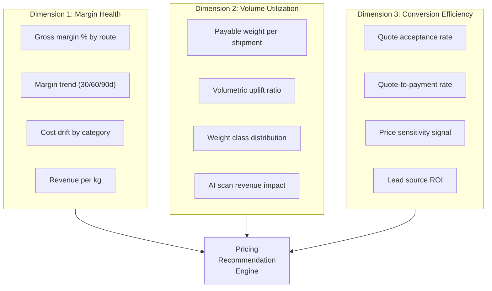
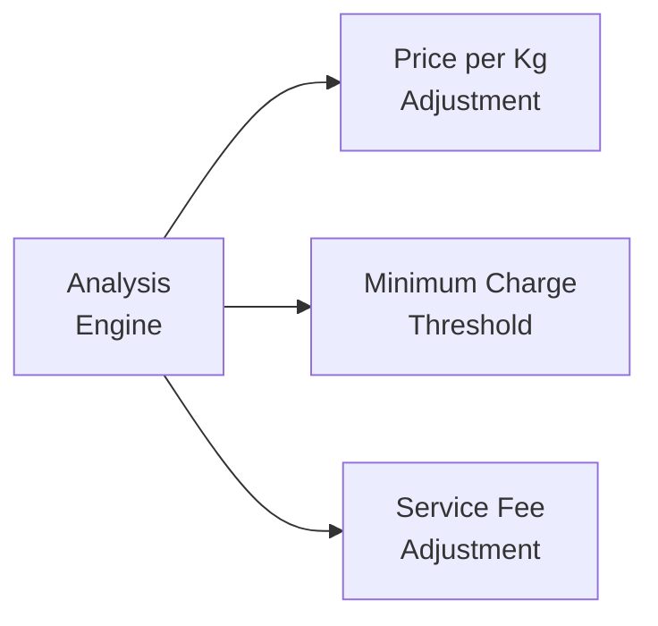
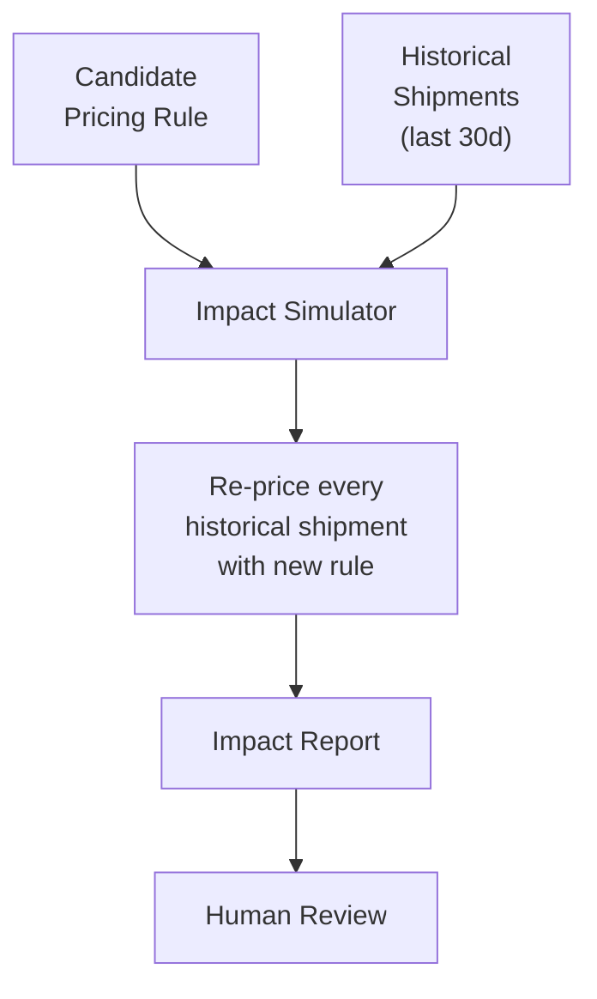
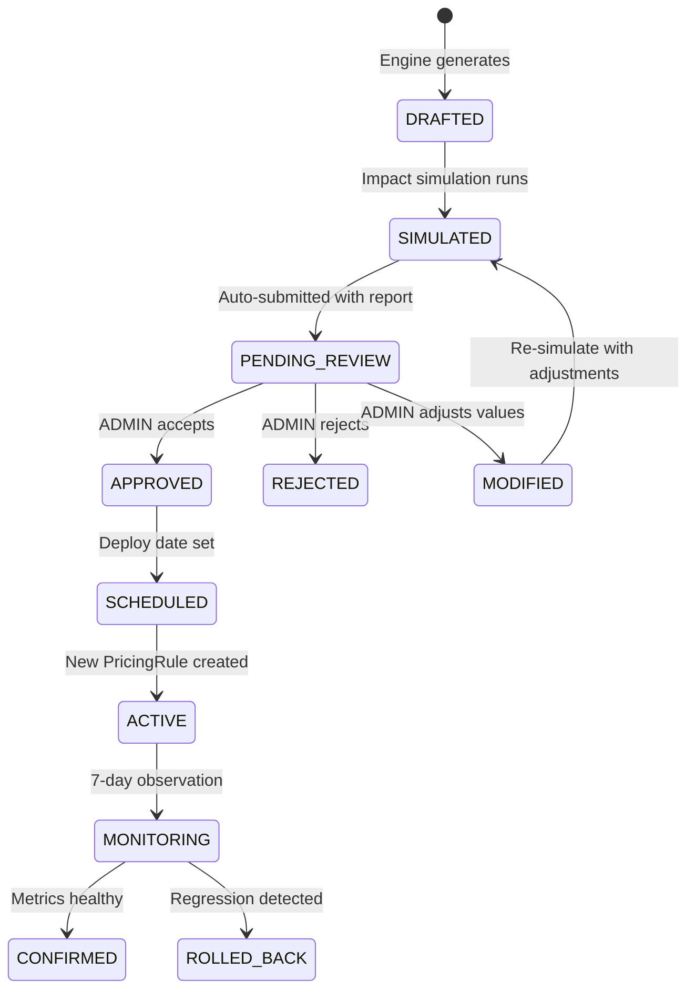
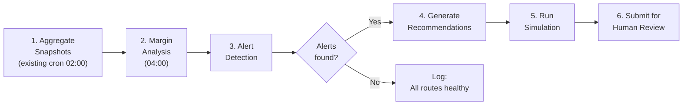

# Pricing & Margin Optimization Loop

> **Version**: 1.0 — 2026-02-07
> **Author**: Senior Backend Engineer — Pricing & Margin
> **Status**: DRAFT — Pending Review
> **Parent Spec**: [Learning System Specification](./LEARNING_SYSTEM_SPEC.md) — Loop 2

---

## 1. Executive Summary

This specification defines an **automated analysis and recommendation engine** for pricing and margin optimization across TransLogistics routes. The system:

- **Analyzes** historical margin, volume, and conversion data from existing `RoutePerformanceSnapshot`, `VolumeMetricsSnapshot`, and `LeadSourceSnapshot` stores
- **Generates** explainable pricing recommendations (price-per-kg, minimum charges, service fees)
- **Simulates** the projected impact before any change takes effect
- **Requires** explicit human approval — no automatic pricing changes, no retroactive impact

> [!IMPORTANT]
> The engine operates in **advisory mode only**. Every pricing recommendation is a `CANDIDATE` that must pass human review, impact simulation, and versioned deployment before affecting any live quote.

---

## 2. Data Foundation

### 2.1 Existing Data Assets

The platform already captures everything needed for margin optimization via Phase 7 (Business Intelligence & Transparency):



| Data Source | Model | Key Fields | Frequency |
|:---|:---|:---|:---|
| **Revenue** | `RoutePerformanceSnapshot` | `netRevenueXof`, `shipmentCount`, `revenueXof` | Daily (02:00 cron) |
| **Costs** | `RouteCostEntry` | `costType`, `amountXof`, `periodStart/End` | On entry |
| **Margins** | `RoutePerformanceSnapshot` | `grossMarginXof`, `marginPercent`, `isMarginComplete` | Daily |
| **Weight** | `VolumeMetricsSnapshot` | `totalPayableWeightKg`, `revenueUpliftXof` | Daily |
| **Conversion** | `LeadSourceSnapshot` | `leadToQuoteRate`, `quoteToShipmentRate`, `overallConversionRate` | Daily |
| **Pricing Rules** | `PricingRule` | `basePriceXof`, `pricePerKg`, `pricePerCm3`, `version` | On change |
| **Quotes** | `Quote` | `payableWeightKg`, `totalPriceXof`, `weightSource`, `status` | Per quote |

### 2.2 Cost Assumption Transparency

The existing `CostAttributionService` provides explicit data quality tracking:

| Assumption Level | Meaning | Action for Engine |
|:---|:---|:---|
| `ACTUAL` | Cost recorded from real invoices | Full weight in analysis |
| `ESTIMATED` | Estimated from historical data | Flag in recommendation |
| `PRORATED` | Pro-rated from aggregate cost | Reduced confidence |
| `MISSING` | No cost data available | **Exclude from margin calc** — never guess |

> [!WARNING]
> The engine **never** makes pricing recommendations for routes where `isMarginComplete = false` without explicitly flagging the data gap. Margins with `MISSING` cost types carry a `DATA_QUALITY_WARNING` in the recommendation.

---

## 3. Historical Data Analysis

### 3.1 Analysis Dimensions

The engine computes insights across three dimensions:



### 3.2 Margin Analysis Pipeline

#### 3.2.1 Route Margin Profile

```typescript
interface RouteMarginProfile {
  routeId: string;
  routeCode: string;
  analysisWindow: { from: Date; to: Date };

  // Current pricing
  activePricingRule: {
    id: string;
    version: number;
    basePriceXof: Decimal;
    pricePerKg: Decimal;
    pricePerCm3: Decimal;
    minimumPriceXof: Decimal;
    effectiveFrom: Date;
  };

  // Revenue metrics (from RoutePerformanceSnapshot)
  revenue: {
    totalRevenueXof: Decimal;
    netRevenueXof: Decimal;
    avgRevenuePerShipment: Decimal;
    revenuePerKg: Decimal;              // netRevenue / totalPayableWeight
    revenueGrowthPct: number;           // vs previous period
    shipmentCount: number;
  };

  // Cost metrics (from RouteCostEntry + CostAttribution)
  costs: {
    totalCostXof: Decimal;
    costPerShipment: Decimal;
    costPerKg: Decimal;
    breakdown: {
      costType: RouteCostType;
      amountXof: Decimal;
      pctOfTotal: number;
      trendPct: number;                 // vs previous period
      assumptionLevel: CostAssumptionLevel;
    }[];
    dataCompleteness: number;           // % of days with ACTUAL costs
  };

  // Margin metrics
  margin: {
    grossMarginXof: Decimal;
    marginPercent: Decimal;
    marginTrend: 'IMPROVING' | 'STABLE' | 'DECLINING' | 'CRITICAL';
    marginTrendPct: number;             // Change vs previous period
    isComplete: boolean;
    daysWithCompleteData: number;
    totalDaysInWindow: number;
  };

  // Delivery metrics
  delivery: {
    avgDeliveryDays: number;
    deliveryDaysTrend: number;          // vs previous period
  };
}
```

#### 3.2.2 Margin Trend Detection

The engine classifies each route's margin health using a rolling window:

| Classification | Condition | Action |
|:---|:---|:---|
| **IMPROVING** | Margin % increased ≥ 2pp over 30d | Monitor only |
| **STABLE** | Margin % within ±2pp over 30d | No action needed |
| **DECLINING** | Margin % decreased ≥ 2pp over 30d | Generate recommendation |
| **CRITICAL** | Margin % below 5% OR negative for 7+ consecutive days | **Priority alert** + recommendation |

```typescript
interface MarginAlert {
  routeId: string;
  routeCode: string;
  severity: 'INFO' | 'WARNING' | 'CRITICAL';
  alertType:
    | 'MARGIN_DECLINING'       // Steady decline
    | 'MARGIN_BELOW_THRESHOLD' // Below 5% target
    | 'MARGIN_NEGATIVE'        // Losing money
    | 'COST_SPIKE'             // Single cost category spiked > 25%
    | 'REVENUE_DROP'           // Revenue per kg dropped > 10%
    | 'DATA_QUALITY_WARNING';  // Too many MISSING cost types
  currentValue: number;
  threshold: number;
  message: string;                // Human-readable explanation
  detectedAt: Date;
}
```

---

### 3.3 Volume Utilization Analysis

#### 3.3.1 Weight Class Distribution

Segments shipments by weight class to reveal pricing opportunities:

```typescript
interface WeightClassAnalysis {
  routeId: string;
  analysisWindow: { from: Date; to: Date };

  classes: {
    class: 'MICRO' | 'SMALL' | 'MEDIUM' | 'LARGE' | 'HEAVY';
    weightRange: { minKg: number; maxKg: number };
    shipmentCount: number;
    pctOfTotal: number;
    avgRevenuePerShipment: Decimal;
    avgMarginPercent: number;
    avgPricePerKg: Decimal;             // Effective price paid
    volumetricUpliftPct: number;        // How much AI adds vs declared
  }[];
}

const WEIGHT_CLASSES = {
  MICRO:  { minKg: 0,    maxKg: 1    },
  SMALL:  { minKg: 1,    maxKg: 5    },
  MEDIUM: { minKg: 5,    maxKg: 20   },
  LARGE:  { minKg: 20,   maxKg: 100  },
  HEAVY:  { minKg: 100,  maxKg: Infinity },
};
```

#### 3.3.2 AI Scan Revenue Impact

Quantifies the financial value of VolumeScan AI:

```typescript
interface AIScanImpact {
  routeId: string;
  analysisWindow: { from: Date; to: Date };

  // Volume deltas
  totalDeclaredWeightKg: Decimal;
  totalPayableWeightKg: Decimal;        // After AI adjustment
  weightUpliftKg: Decimal;              // payable - declared
  weightUpliftPct: number;

  // Financial impact
  revenueWithoutAI: Decimal;            // If declared weight was billed
  revenueWithAI: Decimal;               // Actual revenue (payable weight)
  aiRevenueUpliftXof: Decimal;          // Difference
  aiRevenueUpliftPct: number;

  // Under-declaration analysis
  underDeclaredShipments: number;
  underDeclaredPct: number;
  avgUnderDeclarationPct: number;       // How much customers under-declare
}
```

---

### 3.4 Conversion Efficiency Analysis

#### 3.4.1 Pricing Sensitivity Signal

The **quote rejection/expiry rate** is a proxy for price sensitivity:

```typescript
interface ConversionAnalysis {
  routeId: string;
  analysisWindow: { from: Date; to: Date };

  // Funnel
  totalQuotesGenerated: number;
  quotesAccepted: number;
  quotesRejected: number;
  quotesExpired: number;

  // Rates
  acceptanceRate: number;               // accepted / total
  rejectionRate: number;                // rejected / total
  expiryRate: number;                   // expired / total

  // Price sensitivity indicator
  priceSensitivity: 'LOW' | 'MEDIUM' | 'HIGH';
  // LOW:    acceptanceRate ≥ 70% (price is competitive)
  // MEDIUM: acceptanceRate 50-70% (some resistance)
  // HIGH:   acceptanceRate < 50% (price barrier)

  // Revenue optimization vs conversion
  avgQuotedPrice: Decimal;
  avgAcceptedPrice: Decimal;
  priceElasticity: number;              // Estimated % volume change per % price change

  // Lead source breakdown
  conversionBySource: {
    leadSource: string;
    quoteCount: number;
    acceptanceRate: number;
    avgPrice: Decimal;
  }[];
}
```

#### 3.4.2 Price Elasticity Estimation

A simple regression-based estimate using historical data:

```
Given:
  P₁ = average price in week W
  P₂ = average price in week W+1 (after rule change)
  Q₁ = shipment count in week W
  Q₂ = shipment count in week W+1

Elasticity ≈ (ΔQ/Q) / (ΔP/P)
           = ((Q₂-Q₁)/Q₁) / ((P₂-P₁)/P₁)
```

> [!NOTE]
> Elasticity estimates require **at least 2 pricing rule changes** on the same route with **4+ weeks of data each**. For routes without price history variation, the engine flags `elasticity: null` and uses conservative assumptions.

---

## 4. Pricing Recommendation Engine

### 4.1 Recommendation Types

The engine generates three types of recommendations:



---

### 4.2 Recommendation Type 1 — Price per Kg Change

The core recommendation: adjust `pricePerKg` to maintain target margins.

```typescript
interface PricePerKgRecommendation {
  routeId: string;
  routeCode: string;

  current: {
    pricePerKg: Decimal;
    pricingRuleVersion: number;
    avgMarginPct: number;
  };

  proposed: {
    pricePerKg: Decimal;
    changePct: number;                  // +5.2% or -3.1%
    changeDirection: 'INCREASE' | 'DECREASE' | 'NO_CHANGE';
  };

  // Why this change
  reasoning: PricingReasoning[];

  // Projected impact
  projection: ImpactProjection;
}

interface PricingReasoning {
  factor: ReasoningFactor;
  weight: number;                       // 0.0–1.0 contribution to decision
  description: string;                  // Human-readable
  evidence: {
    metric: string;
    currentValue: number;
    referenceValue: number;
    delta: number;
  };
}

type ReasoningFactor =
  | 'MARGIN_BELOW_TARGET'               // "Margin at 3%, target is 15%"
  | 'COST_INCREASE'                     // "Fuel costs increased 18% on this route"
  | 'VOLUME_DECLINE'                    // "Shipments down 20%, raise per-unit to cover fixed costs"
  | 'HIGH_CONVERSION'                   // "95% acceptance → room to raise price"
  | 'LOW_CONVERSION'                    // "40% acceptance → consider price reduction"
  | 'COMPETITIVE_PRESSURE'              // "Revenue per kg below network average"
  | 'WEIGHT_CLASS_IMBALANCE'            // "80% MICRO packages, minimum charge too low"
  | 'SEASONAL_PATTERN'                  // "Historically higher demand this quarter"
  | 'AI_UPLIFT_OPPORTUNITY';            // "High under-declaration rate on this route"
```

#### Price Calculation Logic

```typescript
function calculateRecommendedPrice(profile: RouteMarginProfile): Decimal {
  const targetMarginPct = 15.0; // Configurable per route
  const currentMargin = profile.margin.marginPercent.toNumber();
  const currentPricePerKg = profile.activePricingRule.pricePerKg;

  // Step 1: Cost-based floor (break-even + minimum margin)
  const costPerKg = profile.costs.costPerKg;
  const priceFloor = costPerKg.mul(1 + 0.05); // Minimum 5% margin

  // Step 2: Target-margin price
  // targetPrice = costPerKg / (1 - targetMargin/100)
  const targetPrice = costPerKg.div(
    new Decimal(1).sub(new Decimal(targetMarginPct).div(100))
  );

  // Step 3: Elasticity dampening
  const elasticity = profile.revenue.priceElasticity ?? -1.5; // Conservative default
  const maxChangePerCycle = 0.10; // Never more than ±10% per recommendation cycle

  // Step 4: Conversion guard
  // If acceptance rate < 50%, cap upward changes at +3%
  const conversionGuard = profile.conversion.acceptanceRate < 0.50
    ? 0.03  // Max +3% when conversion is already low
    : maxChangePerCycle;

  // Step 5: Calculate bounded change
  let proposedPrice = targetPrice;

  // Bound the change
  const changePct = proposedPrice.sub(currentPricePerKg)
    .div(currentPricePerKg)
    .toNumber();

  if (Math.abs(changePct) > conversionGuard) {
    const boundedChange = Math.sign(changePct) * conversionGuard;
    proposedPrice = currentPricePerKg.mul(1 + boundedChange);
  }

  // Never go below floor
  if (proposedPrice.lt(priceFloor)) {
    proposedPrice = priceFloor;
  }

  return proposedPrice.toDecimalPlaces(2);
}
```

---

### 4.3 Recommendation Type 2 — Minimum Charge Threshold

Ensures profitability on small/micro packages where fixed costs dominate.

```typescript
interface MinimumChargeRecommendation {
  routeId: string;
  routeCode: string;

  current: {
    minimumPriceXof: Decimal;
    pctOfShipmentsAtMinimum: number;    // How many hit the floor
    avgMarginAtMinimum: number;         // Margin for those shipments
  };

  proposed: {
    minimumPriceXof: Decimal;
    changePct: number;
  };

  reasoning: PricingReasoning[];
  projection: ImpactProjection;
}
```

#### Calculation Logic

```
If > 30% of shipments hit the minimum charge floor:
  → The floor is effectively the dominant price
  → Ensure floor covers: avgCostPerDelivery + targetMargin

Minimum ≥ avgCostPerShipment / (1 - targetMargin)
```

---

### 4.4 Recommendation Type 3 — Service Fee Adjustment

Adjustments to volume-based pricing (`pricePerCm3`) and base price.

```typescript
interface ServiceFeeRecommendation {
  routeId: string;
  routeCode: string;

  current: {
    basePriceXof: Decimal;
    pricePerCm3: Decimal;
  };

  proposed: {
    basePriceXof: Decimal;
    pricePerCm3: Decimal;
    basePriceChangePct: number;
    volumePriceChangePct: number;
  };

  reasoning: PricingReasoning[];
  projection: ImpactProjection;
}
```

---

## 5. Impact Simulation

### 5.1 What-If Simulator

Before any pricing change is applied, the engine runs a **historical replay simulation** to project outcomes.



### 5.2 Simulation Method

For each historical shipment in the analysis window:

```typescript
function simulateImpact(
  historicalShipments: HistoricalShipment[],
  currentRule: PricingRule,
  proposedRule: ProposedPricingRule,
): ImpactProjection {
  let currentTotalRevenue = new Decimal(0);
  let proposedTotalRevenue = new Decimal(0);
  let affectedShipments = 0;

  for (const shipment of historicalShipments) {
    const currentPrice = computePrice(shipment, currentRule);
    const proposedPrice = computePrice(shipment, proposedRule);

    currentTotalRevenue = currentTotalRevenue.add(currentPrice);
    proposedTotalRevenue = proposedTotalRevenue.add(proposedPrice);

    if (!currentPrice.eq(proposedPrice)) {
      affectedShipments++;
    }
  }

  // Apply elasticity correction (optional)
  const priceChange = proposedTotalRevenue.sub(currentTotalRevenue)
    .div(currentTotalRevenue).toNumber();
  const volumeAdjustment = priceChange * (elasticity ?? 0);
  const adjustedVolume = historicalShipments.length * (1 + volumeAdjustment);

  return {
    currentRevenue: currentTotalRevenue,
    projectedRevenue: proposedTotalRevenue,
    revenueChange: proposedTotalRevenue.sub(currentTotalRevenue),
    revenueChangePct: priceChange * 100,
    affectedShipments,
    totalShipments: historicalShipments.length,
    volumeImpactEstimate: volumeAdjustment * 100,
    adjustedProjectedRevenue: proposedTotalRevenue.mul(1 + volumeAdjustment),
  };
}
```

### 5.3 Impact Projection Data Contract

```typescript
interface ImpactProjection {
  // Revenue impact
  currentRevenue: Decimal;              // What was earned (historical)
  projectedRevenue: Decimal;            // What would have been earned
  revenueChange: Decimal;               // Delta (signed)
  revenueChangePct: number;

  // Volume impact (elasticity-adjusted)
  volumeImpactPct: number;              // Estimated conversion change
  adjustedProjectedRevenue: Decimal;    // Revenue after volume adjustment

  // Margin impact
  currentMarginPct: number;
  projectedMarginPct: number;
  marginDelta: number;

  // Operational impact
  affectedShipments: number;
  totalShipments: number;
  affectedPct: number;

  // Per-weight-class breakdown
  byWeightClass: {
    class: string;
    currentAvgPrice: Decimal;
    proposedAvgPrice: Decimal;
    changePct: number;
    shipmentCount: number;
  }[];

  // Confidence
  confidence: 'HIGH' | 'MEDIUM' | 'LOW';
  confidenceFactors: string[];          // What affects confidence
  simulationWindow: { from: Date; to: Date };
  sampleSize: number;
}
```

### 5.4 Confidence Assessment

| Confidence | Conditions |
|:---|:---|
| **HIGH** | ≥ 100 shipments, ≥ 90% cost completeness, elasticity data available |
| **MEDIUM** | 30–99 shipments OR 60–90% cost completeness |
| **LOW** | < 30 shipments OR < 60% cost completeness OR no elasticity data |

---

## 6. Safety Guards

### 6.1 Hard Limits

These limits **cannot be overridden**, even by SUPER_ADMIN:

| Guard | Limit | Rationale |
|:---|:---|:---|
| **Max single-cycle change** | ±10% per recommendation | Prevent shock pricing |
| **Max cumulative change (90d)** | ±25% from 90-day-ago price | Protect customer trust |
| **Minimum price floor** | `≥ cost per kg × 1.05` | Never sell below cost |
| **Maximum price ceiling** | `≤ 3 × network avg price per kg` | Prevent outlier pricing |
| **No retroactive impact** | Changes apply to new quotes only | Immutable quote snapshots |

### 6.2 Approval Workflow



### 6.3 Access Control

| Action | Required Role | Audit |
|:---|:---|:---|
| View recommendations | `OPERATOR`, `ADMIN`, `SUPER_ADMIN` | Read log |
| Run impact simulation | `ADMIN`, `SUPER_ADMIN` | `PricingDecisionLog` |
| Modify recommendation values | `ADMIN`, `SUPER_ADMIN` | `PricingDecisionLog` + diff |
| Approve recommendation | `SUPER_ADMIN` only | `PricingDecisionLog` |
| Deploy new PricingRule | `SUPER_ADMIN` only | New `PricingRule` version created |
| Trigger rollback | `ADMIN`, `SUPER_ADMIN` | `PricingDecisionLog` + rule deactivation |

### 6.4 Post-Deployment Monitoring

After a pricing change is deployed, the engine enters a **7-day monitoring window**:

| Monitor | Trigger | Action |
|:---|:---|:---|
| **Conversion crash** | Quote acceptance rate drops > 20pp | **Alert** + recommend rollback |
| **Revenue per shipment drop** | Revenue/shipment drops > 15% | **Alert** + investigation |
| **Volume cliff** | Shipment count drops > 30% WoW | **Immediate alert** to SUPER_ADMIN |
| **Margin target miss** | Margin still below target after 7d | Generate follow-up recommendation |
| **Customer complaints** | Manual flag by operations | Pause monitoring, escalate |

### 6.5 Rollback Protocol

Rolling back a pricing change is **non-destructive**:

1. The current `PricingRule` is set to `status = DEPRECATED`
2. The previous `PricingRule` version is set to `status = ACTIVE`
3. All **existing quotes** remain untouched (immutable snapshots)
4. Only **new quotes** use the reverted pricing rule
5. A `PricingDecisionLog` entry records the rollback with reason

---

## 7. Governance Data Model

### 7.1 Recommendation Record

```typescript
interface PricingRecommendation {
  id: string;
  batchId: string;                      // Groups recommendations from same analysis run
  routeId: string;
  routeCode: string;
  type: 'PRICE_PER_KG' | 'MINIMUM_CHARGE' | 'SERVICE_FEE';
  status: 'DRAFTED' | 'SIMULATED' | 'PENDING_REVIEW'
        | 'APPROVED' | 'REJECTED' | 'MODIFIED'
        | 'SCHEDULED' | 'ACTIVE' | 'MONITORING'
        | 'CONFIRMED' | 'ROLLED_BACK';

  // Current state
  currentValues: {
    basePriceXof: Decimal;
    pricePerKg: Decimal;
    pricePerCm3: Decimal;
    minimumPriceXof: Decimal;
    pricingRuleVersion: number;
  };

  // Proposed changes
  proposedChanges: {
    basePriceXof?: Decimal;
    pricePerKg?: Decimal;
    pricePerCm3?: Decimal;
    minimumPriceXof?: Decimal;
  };

  // Analysis
  reasoning: PricingReasoning[];
  analysisWindow: { from: Date; to: Date };
  dataCompleteness: number;             // % of data with ACTUAL costs

  // Simulation (populated after simulation runs)
  simulation?: ImpactProjection;

  // Deployment
  scheduledFor?: Date;
  deployedPricingRuleId?: string;
  deployedPricingRuleVersion?: number;

  // Lifecycle
  createdAt: Date;
  reviewedAt?: Date;
  reviewedByUserId?: string;
  approvedAt?: Date;
  approvedByUserId?: string;
  deployedAt?: Date;
  rolledBackAt?: Date;
  rolledBackByUserId?: string;
  rollbackReason?: string;
  confirmedAt?: Date;
}
```

### 7.2 Decision Audit Log

```typescript
interface PricingDecisionLog {
  id: string;
  recommendationId: string;
  action: 'CREATED' | 'SIMULATED' | 'REVIEWED' | 'MODIFIED'
        | 'APPROVED' | 'REJECTED' | 'DEPLOYED' | 'ROLLBACK'
        | 'MONITORING_ALERT' | 'CONFIRMED';
  performedByUserId?: string;           // null for system actions
  previousValues?: Record<string, unknown>;
  newValues?: Record<string, unknown>;
  reason?: string;
  metadata?: Record<string, unknown>;
  createdAt: Date;                      // No updatedAt — immutable
}
```

---

## 8. Engine Execution Schedule

### 8.1 Batch Schedule

| Job | Schedule | Scope |
|:---|:---|:---|
| **Margin Analysis** | Weekly (Sunday 04:00 Africa/Abidjan) | All ACTIVE routes |
| **Alert Detection** | Daily (03:00, after analytics cron) | All ACTIVE routes |
| **Impact Simulation** | On-demand (triggered by review) | Single route |
| **Post-Deploy Monitoring** | Daily (during 7-day window) | Deployed routes |

### 8.2 Job Pipeline



---

## 9. Implementation Phases

### Phase P1 — Margin Analysis Dashboard
- Implement `RouteMarginProfile` computation from existing snapshots
- Build Margin Health Dashboard (extension of Analytics Dashboard)
- Implement margin trend classification (IMPROVING/STABLE/DECLINING/CRITICAL)
- Implement daily alert detection job
- **No recommendations yet** — visibility only

### Phase P2 — Recommendation Engine
- Implement `PricePerKgRecommendation` calculator
- Implement `MinimumChargeRecommendation` calculator
- Build recommendation review UI with approval workflow
- Implement weight class analysis
- Store recommendations in `PricingRecommendation` table

### Phase P3 — Impact Simulation
- Implement historical replay simulator
- Build simulation results visualization (before/after comparison)
- Implement confidence scoring
- Add elasticity estimation from pricing history

### Phase P4 — Deployment & Monitoring
- Implement PricingRule deployment from approved recommendations
- Build 7-day post-deployment monitoring
- Implement automatic rollback triggers
- Close the feedback loop: deployment outcomes feed next analysis cycle

---

## 10. Success Metrics

| Metric | Baseline | Target (6mo) | Measurement |
|:---|:---|:---|:---|
| Routes with margin > 15% | Unknown | ≥ 80% of routes | `RoutePerformanceSnapshot` |
| Average network margin | Unknown | ≥ 15% | Weighted average |
| Recommendation acceptance rate | N/A | ≥ 60% | `PricingRecommendation.status` |
| Time to detect margin decline | N/A | ≤ 7 days | Alert detection latency |
| Post-change conversion stability | N/A | ≤ 5pp drop | Quote acceptance delta |
| Revenue per kg growth | Baseline | +10% | `RoutePerformanceSnapshot` |
| Pricing decisions with complete data | Unknown | ≥ 80% | `isMarginComplete` rate |
