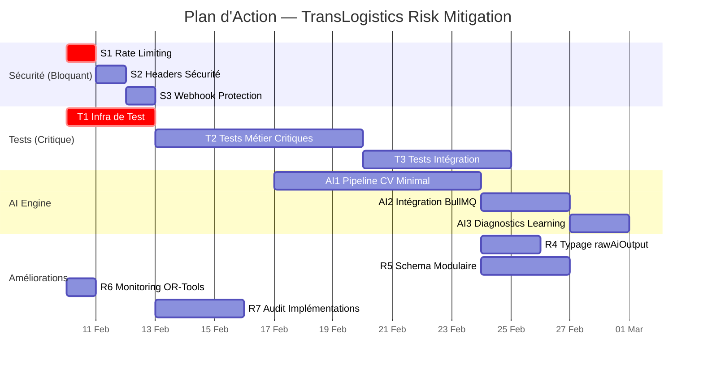

# Plan d'Action — Mitigation des Risques TransLogistics

> **Version**: 1.0 — 2026-02-07
> **Auteur**: Audit Technique Lead
> **Status**: DRAFT — En Attente de Review

---

## Résumé des Constats

| # | Risque / Point à Surveiller | Sévérité | Effort |
|:--|:---|:---|:---|
| R1 | AI Engine = scaffold vide (pas de CV pipeline) | 🔴 Critique | XL |
| R2 | Zéro tests dans le codebase | 🔴 Critique | L |
| R3 | Pas de rate limiting ni protection API | 🔴 Critique | S |
| R4 | `rawAiOutput` JSON non typé | 🟡 Modéré | S |
| R5 | Prisma schema monolithique (1624 lignes) | 🟡 Modéré | M |
| R6 | Fallback OR-Tools non monitoré | 🟡 Modéré | S |
| R7 | Implémentation concrète des services à auditer | 🟡 Modéré | M |

---

## Chantier 1 — Suite de Tests Critique (R2)

### Pourquoi c'est prioritaire

Le système gère de l'argent réel (Mobile Money, ledger financier) et des transitions d'état irréversibles. Sans tests, chaque déploiement est un risque de régression financière.

### Plan d'Action

#### Phase T1 — Infrastructure de Test (2-3 jours)

| Action | Détail |
|:---|:---|
| Installer le framework de test | Vitest (recommandé pour monorepo pnpm) ou Jest |
| Configurer le test runner | `vitest.config.ts` dans `apps/api/`, scripts `test` / `test:watch` dans `package.json` |
| Créer les helpers de test | Mock Prisma Client (via `vitest-mock-extended`), factory de données, contexte `ServiceContext` de test |
| CI check | Ajouter un `pnpm test` dans le pipeline CI (GitHub Actions ou autre) |

#### Phase T2 — Tests Critiques Métier (5-7 jours)

Tests unitaires prioritaires sur les **invariants financiers** :

| Service | Tests Critiques | Couverture Cible |
|:---|:---|:---|
| **QuoteService** | Calcul `payableWeightKg = max(real, volumetric)`, immutabilité après ACCEPTED, expiration des devis, prix minimum | 90% |
| **PaymentService** | Transitions d'état (INITIATED→CONFIRMED→REFUNDED), idempotence des webhooks, cohérence montant quote/payment | 90% |
| **ShipmentService** | Machine à états complète (transitions valides/invalides), impossible d'annuler après livraison | 85% |
| **ScanService** | Seuils de confiance (auto-accept 0.85, manual 0.60), validation manuelle override, rejet | 80% |
| **CostAttribution** | Marge transparente, flags `isMarginComplete`, pas de marge silencieuse sur coûts manquants | 85% |

#### Phase T3 — Tests d'Intégration (3-5 jours)

| Flux | Scénario |
|:---|:---|
| **Scan→Quote→Payment** | Photo → AI result → devis calculé → paiement confirmé → ledger entry créée |
| **Webhook idempotence** | Même webhook reçu 3× → un seul changement d'état |
| **Pricing immutabilité** | Changement de PricingRule → anciens devis inchangés |
| **Dispatch lifecycle** | RoutePlan → DispatchTask → ShipmentDelivery → DeliveryProof |

---

## Chantier 2 — Sécurité API (R3)

### Constat actuel

Le dossier `middleware/` ne contient que 2 fichiers : `error-handler.ts` et `logger.ts`. **Aucun rate limiting, CORS configuré, ni protection contre les attaques par volume.**

### Plan d'Action

#### Phase S1 — Rate Limiting (1 jour)

```typescript
// Middleware à ajouter: apps/api/src/middleware/rate-limiter.ts
// Package: express-rate-limit + rate-limit-redis (pour Redis store)

// Configuration recommandée:
const RATE_LIMITS = {
  global:    { windowMs: 15 * 60 * 1000, max: 100  },  // 100 req/15min global
  webhooks:  { windowMs: 1  * 60 * 1000, max: 50   },  // 50 req/min webhooks
  auth:      { windowMs: 15 * 60 * 1000, max: 5    },  // 5 tentatives/15min login
  scan:      { windowMs: 1  * 60 * 1000, max: 10   },  // 10 scans/min
  whatsapp:  { windowMs: 1  * 60 * 1000, max: 30   },  // 30 msg/min WhatsApp
};
```

#### Phase S2 — Headers de Sécurité (0.5 jour)

| Middleware | Package | Rôle |
|:---|:---|:---|
| `helmet` | `helmet` | Headers sécurité (CSP, X-Frame, HSTS…) — déjà importé, vérifier config |
| `cors` | `cors` | Origines autorisées (web dashboard, driver PWA) |
| `express-slow-down` | `express-slow-down` | Ralentissement progressif avant hard limit |

#### Phase S3 — Webhook Protection (1 jour)

| Action | Détail |
|:---|:---|
| Signature verification | Vérifier HMAC de CinetPay / Stripe sur chaque webhook entrant |
| Circuit breaker | Si > 100 webhooks/minute pour un même `paymentId`, bloquer et alerter |
| Dead letter queue | Webhooks échoués → Redis queue pour replay manuel |

---

## Chantier 3 — AI Engine Implementation (R1)

### Constat actuel

Le dossier `services/ai-engine/app/` contient :
- `config.py` — Configuration (seuils, version modèle)
- `main.py` — FastAPI app avec health check
- `routers/` — Vide (probablement health uniquement)
- `services/` — 1 fichier (probablement vide/stub)

L'orchestration côté API (BullMQ, callback) est en place, mais **le cœur du traitement d'image n'existe pas**.

### Plan d'Action

#### Phase AI1 — Pipeline CV Minimal (5-7 jours)

| Étape | Implémentation |
|:---|:---|
| **Réception d'image** | Endpoint `POST /scan` recevant l'image + metadata |
| **Détection A4** | OpenCV contour detection → identification du rectangle A4 → calibration px/mm |
| **Détection package** | Contour detection du colis → bounding box → dimensions L × W en mm |
| **Estimation hauteur** | Heuristic (ratio shadow, aspect ratio, ou valeur par défaut 0.30 × max(L,W)) |
| **Score de confiance** | Composite : sharpness (Laplacian) + A4 detection quality + bbox stability |
| **Réponse JSON** | Dimensions + confidence + diagnostics complets (pour `rawAiOutput`) |

#### Phase AI2 — Intégration BullMQ (2-3 jours)

| Action | Détail |
|:---|:---|
| Connecter au flux existant | L'API envoie déjà des `ScanRequest` → AI Engine doit consommer et callback |
| Callback API | `POST /api/internal/scan-results/:id/complete` avec résultats |
| Retry logic | Respecter `maxAttempts: 3` défini dans `ScanRequest` |

#### Phase AI3 — Diagnostics pour Learning (1-2 jours)

Formaliser le schema `rawAiOutput` (voir R4 ci-dessous) pour alimenter les learning loops.

---

## Chantier 4 — Typage du `rawAiOutput` (R4)

### Plan d'Action (1-2 jours)

Créer un **type Zod partagé** validant le JSON stocké dans `rawAiOutput` :

```typescript
// packages/utils/src/schemas/scan-diagnostics.schema.ts

import { z } from 'zod';

export const ScanDiagnosticsSchema = z.object({
  // Image quality
  imageWidthPx: z.number(),
  imageHeightPx: z.number(),
  laplacianVariance: z.number(),        // Sharpness metric

  // A4 detection
  a4Detected: z.boolean(),
  a4DetectionConfidence: z.number().min(0).max(1),
  a4CornersPx: z.array(z.object({ x: z.number(), y: z.number() })).length(4).optional(),
  a4AspectRatioDelta: z.number().optional(),  // Deviation from 210/297

  // Package detection
  packageBboxCount: z.number(),
  packageBboxPx: z.object({
    x: z.number(), y: z.number(),
    width: z.number(), height: z.number(),
  }).optional(),

  // Calibration
  pixelsPerMm: z.number().optional(),

  // Pipeline timing
  pipelineTimings: z.record(z.number()).optional(),  // { "a4_detection_ms": 45, ... }
});

export type ScanDiagnostics = z.infer<typeof ScanDiagnosticsSchema>;
```

| Action | Détail |
|:---|:---|
| Créer le schéma Zod | `packages/utils/src/schemas/scan-diagnostics.schema.ts` |
| Valider côté AI Engine | Python : utiliser un Pydantic model miroir |
| Valider côté API | Utiliser le schéma Zod au `recordScanResult()` — log warning si invalide (pas de rejet) |
| Documenter | Ajouter le contrat dans `VOLUMESCAN_LEARNING_LOOP.md` |

---

## Chantier 5 — Prisma Schema Modulaire (R5)

### Constat

1624 lignes dans un seul `schema.prisma`. Ça fonctionne, mais les migrations deviennent risquées et les équipes ne peuvent pas travailler en parallèle sans conflits.

### Plan d'Action (2-3 jours)

#### Option A — Multi-file Prisma Schema (Prisma 5.15+)

Depuis Prisma 5.15, le `prismaSchemaFolder` feature permet de découper le schéma :

```
prisma/
├── schema/
│   ├── _base.prisma          // datasource + generator
│   ├── enums.prisma           // Tous les enums
│   ├── user.prisma            // User + Referral
│   ├── hub.prisma             // Hub + Route
│   ├── shipment.prisma        // Shipment + Quote + ScanResult + Payment
│   ├── dispatch.prisma        // Driver + Vehicle + RoutePlan + DispatchTask
│   ├── shop-and-ship.prisma   // PurchaseRequest + SupplierOrder + Consolidation
│   ├── whatsapp.prisma        // WhatsAppSession + AuditLog
│   └── analytics.prisma       // Snapshots + RouteCostEntry
```

| Action | Détail |
|:---|:---|
| Vérifier version Prisma | Doit être ≥ 5.15 pour `prismaSchemaFolder` |
| Activer le feature flag | `previewFeatures = ["prismaSchemaFolder"]` dans `generator` |
| Découper le fichier | Séparation par bounded context (pas de changement de schéma, juste du split) |
| Vérifier les migrations | `prisma migrate diff` pour confirmer : zero diff après découpage |

#### Option B — Si Prisma < 5.15

Rester sur le fichier unique mais organiser avec des **commentaires séparateurs** (déjà fait) et ajouter une **table des matières** en haut du fichier avec les numéros de ligne.

---

## Chantier 6 — Monitoring du Fallback OR-Tools (R6)

### Plan d'Action (0.5 jour)

| Action | Détail |
|:---|:---|
| Logger le fallback | Ajouter un compteur/métrique quand `optimizationMethod = 'NEAREST_NEIGHBOR'` |
| Alerte | Si > 20% des routes utilisent le fallback sur 24h → notification opérations |
| Dashboard | Ajouter un widget dans le dashboard analytics : `OR-Tools usage vs Fallback` |
| Persister la méthode | Stocker `optimizationMethod` dans `RoutePlan` (nouveau champ) |

```typescript
// Ajout dans route-optimization.service.ts:
if (!this.orToolsAvailable) {
    logger.warn({ routePlanId }, 'OR-Tools unavailable, using nearest neighbor fallback');
    // Incrémenter compteur Redis pour monitoring
}
```

---

## Chantier 7 — Audit des Implémentations (R7)

### Plan d'Action (2-3 jours)

Générer un **rapport de couverture d'implémentation** :

| Service Interface | Fichier `.service.ts` | Questions |
|:---|:---|:---|
| `IScanService` | `scan.service.ts` | Les 7 méthodes sont-elles implémentées ? |
| `IQuoteService` | `quote.service.ts` | `expireStaleQuotes` est-il branché sur le cron ? |
| `IPaymentService` | `payment.service.ts` | Webhooks CinetPay + Stripe fonctionnels ? |
| `IShipmentService` | `shipment.service.ts` | Toutes les transitions d'état couvertes ? |

| Action | Détail |
|:---|:---|
| Audit de chaque service | Vérifier que chaque méthode d'interface a une implémentation concrète |
| Flag les stubs | Identifier les méthodes qui lancent `throw new Error('Not implemented')` |
| Compléter les implémentations | Prioriser les flows critiques (Quote, Payment, Shipment state machine) |

---

## Ordre de Priorité Recommandé



### Résumé par Sprint

| Sprint | Focus | Efforts | Impact |
|:---|:---|:---|:---|
| **Sprint 1** (Sem. 7) | Sécurité API + Infra Tests + Monitoring OR-Tools | ~5j | Protection immédiate |
| **Sprint 2** (Sem. 8-9) | Tests métier critiques + Audit implémentations | ~10j | Fiabilité métier |
| **Sprint 3** (Sem. 9-10) | AI Engine Pipeline CV + Tests intégration | ~12j | Fonctionnalité VolumeScan |
| **Sprint 4** (Sem. 11) | Typage rawAiOutput + Schema modulaire | ~5j | Maintenabilité long terme |

---

## Vérification

### Critères de Succès

| Chantier | Critère | Mesure |
|:---|:---|:---|
| Tests | ≥ 80% couverture services critiques | `vitest --coverage` |
| Sécurité | Rate limiting actif sur toutes les routes | Test de charge : 101ème requête → 429 |
| AI Engine | Scan photo → dimensions retournées | Test E2E avec image de test |
| Schema | Zero diff après découpage | `prisma migrate diff --exit-code` |
| OR-Tools | Fallback monitoré en dashboard | Widget visible avec données réelles |

### Tests Automatisés

Chaque chantier inclura ses propres tests :
- **Sécurité** : Test que le rate limiter renvoie `429` au-delà du seuil
- **Tests métier** : Suite Vitest sur QuoteService, PaymentService, ShipmentService
- **AI Engine** : Tests pytest sur le pipeline CV avec images de référence
- **Schema** : Script CI vérifiant `prisma validate` + `prisma migrate diff`
