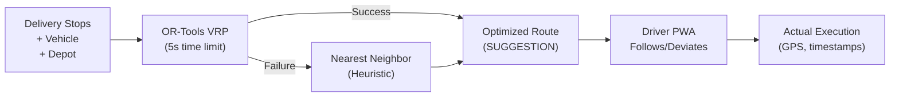
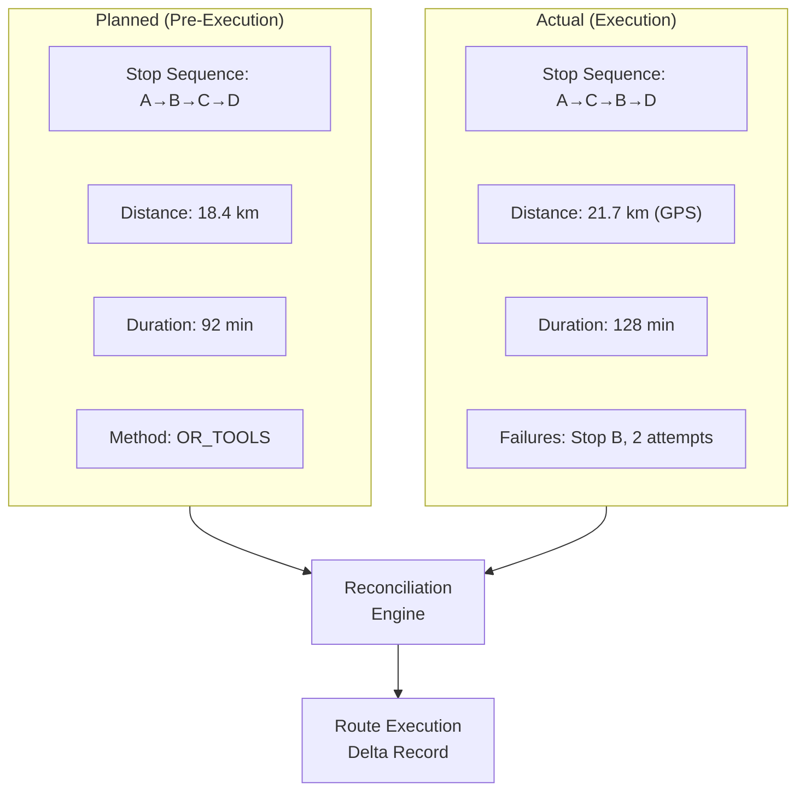
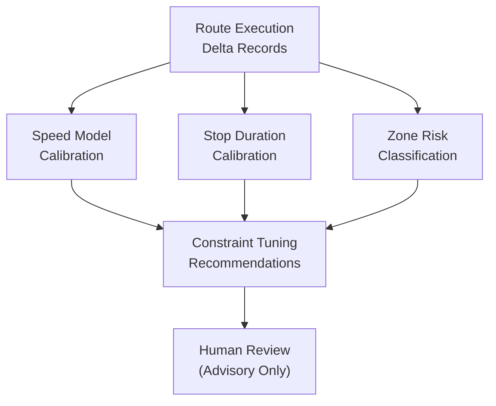
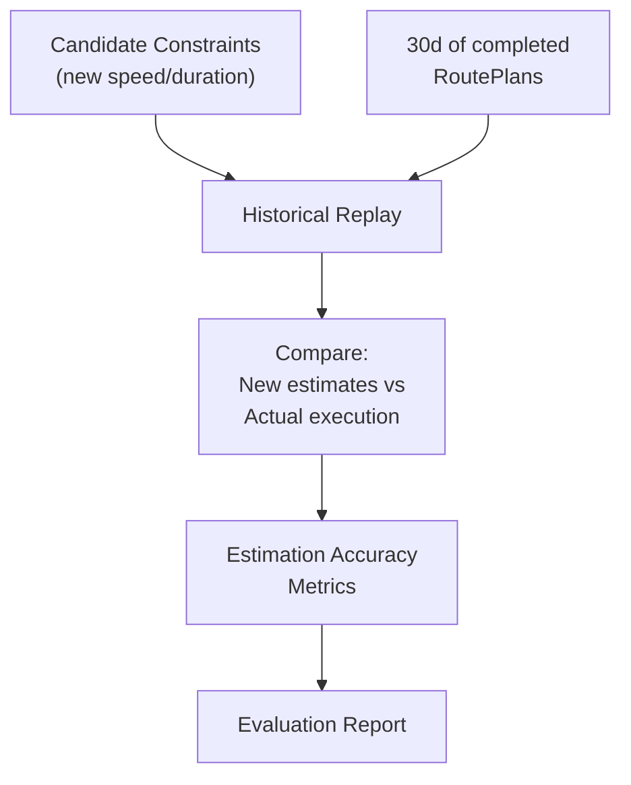
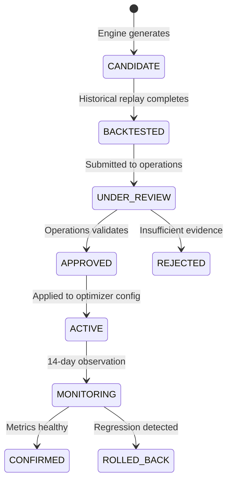
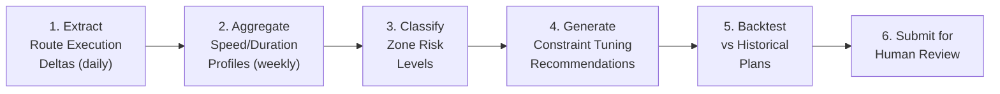

# Routing Efficiency Improvement Loop

> **Version**: 1.0 — 2026-02-07
> **Author**: Senior Optimization Engineer
> **Status**: DRAFT — Pending Review
> **Parent Spec**: [Learning System Specification](./LEARNING_SYSTEM_SPEC.md) — Loop 3

---

## 1. System Context

### 1.1 Smart Dispatch Architecture

The TransLogistics dispatch system uses **OR-Tools VRP** for route optimization, with a **nearest-neighbor** heuristic as fallback. Routes are suggestions that drivers may deviate from in practice, especially in West African urban conditions where addressing is imprecise.



### 1.2 Current Optimizer Constants

| Parameter | Value | Source |
|:---|:---|:---|
| `DEFAULT_SPEED_KMH` | 25 km/h | Hardcoded (African urban) |
| `DEFAULT_STOP_DURATION_MIN` | 10 min | Hardcoded |
| `computeTimeLimit` | 5000 ms | OR-Tools solver config |
| `numIterationsWithoutImprovement` | 100 | OR-Tools solver config |
| Vehicle types | MOTO (30kg), TRICYCLE (150kg), VAN (500kg+) | Prisma schema |
| Location quality levels | PRECISE, APPROXIMATE, LANDMARK | `DeliveryStop.locationQuality` |
| Distance model | Haversine (great-circle) | No road-network data |

### 1.3 Existing Execution Data

The platform captures rich actual-vs-planned data:

| Data Point | Source Model | Fields |
|:---|:---|:---|
| **Planned route** | `OptimizedRoute` | `orderedStops[]`, `totalDistanceKm`, `estimatedDurationMinutes`, `optimizationMethod` |
| **Plan lifecycle** | `RoutePlan` | `startedAt`, `completedAt`, `totalKm`, `driverId`, `vehicleId`, `hubId` |
| **Per-stop actual** | `ShipmentDelivery` | `pickedUpAt`, `deliveredAt`, `attemptCount`, `failureReason`, `status` |
| **GPS proof** | `DeliveryProof` | `capturedLat`, `capturedLng`, `capturedAt` |
| **Task timestamps** | `DispatchTask` | `assignedAt`, `enRoutePickupAt`, `pickedUpAt`, `enRouteDeliveryAt`, `deliveredAt`, `failedAt` |

> [!IMPORTANT]
> Unlike the VolumeScan loop, the dispatch loop must reconcile two fundamentally different data shapes: an **optimized plan** (static, computed pre-execution) and **actual execution events** (timestamped, sequential, with deviations). The reconciliation logic is the core innovation of this loop.

---

## 2. Estimated vs Actual Comparison

### 2.1 Comparison Framework



### 2.2 Route Execution Delta Data Contract

```typescript
interface RouteExecutionDelta {
  routePlanId: string;
  driverId: string;
  vehicleId: string;
  vehicleType: 'MOTO' | 'TRICYCLE' | 'VAN';
  hubId: string;
  planDate: Date;
  datasetVersion: string;            // e.g. "2026-W06"

  // Timing comparison
  timing: {
    plannedDurationMin: number;       // From OptimizedRoute
    actualDurationMin: number;        // completedAt - startedAt
    durationDeltaMin: number;         // actual - planned (positive = slower)
    durationDeltaPct: number;         // delta / planned × 100
    startedAt: Date;
    completedAt: Date;
  };

  // Distance comparison
  distance: {
    plannedDistanceKm: number;        // From OptimizedRoute
    actualDistanceKm: number;         // From RoutePlan.totalKm or GPS reconstruction
    distanceDeltaKm: number;          // actual - planned
    distanceDeltaPct: number;
    distanceSource: 'ROUTE_PLAN_FIELD' | 'GPS_RECONSTRUCTION' | 'HAVERSINE_PROOF';
  };

  // Sequence comparison
  sequence: {
    plannedStopOrder: string[];       // Stop IDs in planned order
    actualStopOrder: string[];        // Stop IDs by actual delivery time
    sequenceMatch: boolean;           // Did driver follow the plan?
    kendallTau: number;               // Rank correlation (-1 to +1, 1 = perfect match)
    swappedPairs: {                   // Which stops were reordered
      stopA: string;
      stopB: string;
      plannedBeforeB: boolean;
      possibleReason: SwapReason;
    }[];
    totalStops: number;
    completedStops: number;
    skippedStops: number;
  };

  // Stop-level analysis
  stops: StopDelta[];

  // Aggregate quality
  optimizationMethod: 'OR_TOOLS' | 'NEAREST_NEIGHBOR' | 'AS_PROVIDED';
  planQualityScore: number;           // 0–100 composite score
  flags: ExecutionFlag[];
}

type SwapReason =
  | 'TRAFFIC_AVOIDANCE'       // Driver likely avoided congestion
  | 'FAILED_DELIVERY'         // Previous stop failed, moved to next
  | 'PROXIMITY_PREFERENCE'    // Driver chose closer stop
  | 'UNKNOWN';

type ExecutionFlag =
  | 'DURATION_EXCEEDED_50PCT'  // Route took 50%+ longer than estimated
  | 'DISTANCE_EXCEEDED_30PCT'  // Route was 30%+ longer
  | 'SEQUENCE_MISMATCH'        // Driver deviated from plan
  | 'MULTIPLE_FAILURES'        // 2+ delivery failures in plan
  | 'DELIVERY_CLUSTER_SKIP'    // Driver skipped a stop cluster
  | 'EXCESSIVE_IDLE'           // Long gaps between stops
  | 'GPS_DATA_MISSING';        // Insufficient GPS for analysis
```

### 2.3 Per-Stop Delta

```typescript
interface StopDelta {
  stopId: string;
  shipmentDeliveryId: string;

  // Position in sequence
  plannedSequence: number;
  actualSequence: number;
  sequenceDelta: number;             // actual - planned

  // Timing
  plannedArrivalMin: number;         // From OptimizedRoute.estimatedArrivalMinutes
  actualArrivalMin: number;          // Derived from deliveredAt - plan.startedAt
  arrivalDeltaMin: number;

  // Per-leg distance
  plannedLegDistanceKm: number;      // From OptimizedStop.distanceFromPreviousKm
  actualLegDistanceKm: number;       // GPS or Haversine between proof locations
  legDistanceDeltaKm: number;

  // Delivery outcome
  status: 'DELIVERED' | 'FAILED' | 'SKIPPED';
  attemptCount: number;
  failureReason: string | null;
  dwellTimeMin: number;              // Time spent at stop (arrival to departure)

  // Location quality
  locationQuality: 'PRECISE' | 'APPROXIMATE' | 'LANDMARK';
  gpsDeviationMeters: number | null; // Distance between planned coords and GPS proof
}
```

### 2.4 Actual Distance Reconstruction

Since the system doesn't track continuous GPS traces, actual distance is reconstructed from delivery proof locations:

```typescript
function reconstructActualDistance(
  proofs: { lat: number; lng: number; capturedAt: Date }[],
  depotLat: number,
  depotLng: number,
  returnToDepot: boolean,
): { distanceKm: number; source: 'GPS_RECONSTRUCTION' | 'HAVERSINE_PROOF' } {
  // Sort proofs chronologically
  const sorted = proofs.sort((a, b) => a.capturedAt.getTime() - b.capturedAt.getTime());

  if (sorted.length < 2) {
    return { distanceKm: 0, source: 'HAVERSINE_PROOF' };
  }

  let totalDistance = haversineDistance(depotLat, depotLng, sorted[0].lat, sorted[0].lng);

  for (let i = 1; i < sorted.length; i++) {
    totalDistance += haversineDistance(
      sorted[i - 1].lat, sorted[i - 1].lng,
      sorted[i].lat, sorted[i].lng,
    );
  }

  if (returnToDepot) {
    const last = sorted[sorted.length - 1];
    totalDistance += haversineDistance(last.lat, last.lng, depotLat, depotLng);
  }

  return { distanceKm: totalDistance, source: 'GPS_RECONSTRUCTION' };
}
```

> [!NOTE]
> GPS reconstruction uses Haversine (straight-line) between delivery proof points. This **underestimates** actual road distance, so the engine applies a configurable `ROAD_FACTOR` multiplier (default 1.3) for more realistic estimates in West African urban environments.

---

## 3. Route Heuristic Learning

### 3.1 Learning Targets

The engine learns improvements to **three** categories of optimizer defaults:



---

### 3.2 Learning Target 1 — Speed Model Calibration

The current optimizer uses a flat `DEFAULT_SPEED_KMH = 25` everywhere. Real speed varies by hub, time of day, vehicle type, and zone.

#### 3.2.1 Speed Profile Data Contract

```typescript
interface SpeedProfileAnalysis {
  segment: SpeedSegment;
  sampleSize: number;
  analysisWindow: { from: Date; to: Date };

  // Current assumption
  currentSpeedKmh: number;            // 25 (hardcoded)

  // Observed speeds
  observedMedianSpeedKmh: number;
  observedP25SpeedKmh: number;        // 25th percentile (pessimistic)
  observedP75SpeedKmh: number;        // 75th percentile (optimistic)
  observedStdDevKmh: number;

  // Recommendation
  recommendedSpeedKmh: number;        // P25 for reliability focus
  confidenceLevel: 'HIGH' | 'MEDIUM' | 'LOW';
  reasoning: string;
}

interface SpeedSegment {
  hubId?: string;                     // Per-hub, or null for network-wide
  vehicleType?: 'MOTO' | 'TRICYCLE' | 'VAN';
  timeOfDay?: 'MORNING_PEAK' | 'MIDDAY' | 'AFTERNOON_PEAK' | 'EVENING';
  dayOfWeek?: 'WEEKDAY' | 'WEEKEND';
}
```

#### 3.2.2 Speed Calculation Method

```
For each completed route plan with GPS proof:

  effectiveSpeedKmh = actualDistanceKm / (actualDurationHours - totalDwellTimeHours)

  Where:
    actualDistanceKm   = Haversine GPS reconstruction × ROAD_FACTOR
    actualDurationHours = (completedAt - startedAt) / 3600000
    totalDwellTimeHours = Σ(dwellTimeMin per stop) / 60
```

#### 3.2.3 Time-of-Day Bins

| Bin | Hours | West African Urban Pattern |
|:---|:---|:---|
| `MORNING_PEAK` | 07:00–09:30 | Heavy congestion, school traffic |
| `MIDDAY` | 09:30–15:00 | Moderate, market area congestion |
| `AFTERNOON_PEAK` | 15:00–18:00 | Return commute, market closures |
| `EVENING` | 18:00–20:00 | Light traffic, poor visibility |

---

### 3.3 Learning Target 2 — Stop Duration Calibration

The current optimizer uses a flat `DEFAULT_STOP_DURATION_MIN = 10` for all stops. Real dwell time depends on delivery context.

#### 3.3.1 Duration Profile Data Contract

```typescript
interface StopDurationProfile {
  segment: DurationSegment;
  sampleSize: number;

  // Current assumption
  currentDurationMin: number;         // 10 (hardcoded)

  // Observed durations
  observedMedianMin: number;
  observedP75Min: number;             // 75th percentile (conservative)
  observedP90Min: number;             // 90th percentile (worst-case planning)
  observedMeanMin: number;

  // Factors
  avgAttemptCount: number;            // More attempts = longer dwell
  failureRate: number;                // % of stops that fail at least once

  // Recommendation
  recommendedDurationMin: number;     // P75 for reliable planning
  reasoning: string;
}

interface DurationSegment {
  hubId?: string;
  vehicleType?: 'MOTO' | 'TRICYCLE' | 'VAN';
  locationQuality?: 'PRECISE' | 'APPROXIMATE' | 'LANDMARK';
  proofType?: 'SIGNATURE' | 'PHOTO' | 'OTP' | 'RECIPIENT_ABSENT';
  weightClass?: 'MICRO' | 'SMALL' | 'MEDIUM' | 'LARGE';
}
```

#### 3.3.2 Dwell Time Extraction

```sql
-- Extract stop dwell time from delivery proof timestamps
-- Assumes: arrival ≈ first GPS proof at stop,
--          departure ≈ next stop's first GPS proof or plan completion

SELECT
  sd.id AS "shipmentDeliveryId",
  dt."routePlanId",
  dp."capturedAt" AS "arrivalAt",
  LEAD(dp."capturedAt") OVER (
    PARTITION BY dt."routePlanId"
    ORDER BY dp."capturedAt"
  ) AS "nextStopArrivalAt",
  EXTRACT(EPOCH FROM (
    LEAD(dp."capturedAt") OVER (
      PARTITION BY dt."routePlanId"
      ORDER BY dp."capturedAt"
    ) - dp."capturedAt"
  )) / 60 AS "dwellTimeMin",
  sd."attemptCount",
  sd.status,
  dp."proofType"
FROM shipment_deliveries sd
JOIN dispatch_tasks dt ON dt.id = sd."dispatchTaskId"
JOIN delivery_proofs dp ON dp."shipmentDeliveryId" = sd.id
WHERE dt."routePlanId" IS NOT NULL
ORDER BY dt."routePlanId", dp."capturedAt";
```

---

### 3.4 Learning Target 3 — Zone Risk Classification

Identify geographic zones with systematically high failure rates, long dwell times, or significant GPS deviations.

#### 3.4.1 Zone Grid

Use a simple rectangular grid (Geohash prefix or lat/lng rounding) to cluster delivery attempts:

```typescript
interface ZoneProfile {
  zoneId: string;                     // e.g. "ABJ-5.35-N3.95-W" (grid cell)
  centerLat: number;
  centerLng: number;
  gridResolution: number;             // Degrees (e.g. 0.01 ≈ 1.1km)
  hubId: string;

  // Volume
  totalDeliveries: number;
  deliveriesLast30d: number;

  // Risk indicators
  failureRate: number;                // % of attempts that fail
  avgAttemptCount: number;
  avgDwellTimeMin: number;
  avgGpsDeviationMeters: number;      // Plan coords vs actual GPS
  sequenceDeviationRate: number;      // How often drivers reorder to/from this zone
  recipientAbsentRate: number;        // RECIPIENT_ABSENT proof type

  // Classification
  riskLevel: 'LOW' | 'MEDIUM' | 'HIGH' | 'CRITICAL';
  riskFactors: ZoneRiskFactor[];

  // Temporal pattern
  peakFailureTimeOfDay: string;       // e.g. "AFTERNOON_PEAK"
  bestDeliveryTimeOfDay: string;      // Lowest failure rate
}

type ZoneRiskFactor =
  | 'HIGH_FAILURE_RATE'        // > 20% delivery failures
  | 'LONG_DWELL_TIME'          // Avg dwell > 15 min
  | 'GPS_DEVIATION'            // Avg GPS deviation > 200m
  | 'SEQUENCE_DISRUPTION'      // Drivers frequently reorder around this zone
  | 'RECIPIENT_ABSENT'         // > 30% absent recipients
  | 'ACCESS_DIFFICULTY'        // Long dwell + multiple attempts
  | 'IMPRECISE_ADDRESSING'     // High % of APPROXIMATE/LANDMARK locations
  | 'TIME_SENSITIVE';          // Strong time-of-day failure pattern
```

#### 3.4.2 Risk Classification Rules

```typescript
const ZONE_RISK_RULES = {
  version: '1.0.0',

  rules: [
    {
      riskLevel: 'CRITICAL',
      condition: 'failureRate > 0.35 OR avgAttemptCount > 2.5',
      recommendation: 'Consider excluding from auto-routing; require manual assignment',
    },
    {
      riskLevel: 'HIGH',
      condition: 'failureRate > 0.20 OR avgDwellTimeMin > 20',
      recommendation: 'Add time buffer; schedule early in route; prefer experienced drivers',
    },
    {
      riskLevel: 'MEDIUM',
      condition: 'failureRate > 0.10 OR gpsDeviationMeters > 200',
      recommendation: 'Add extra stop duration; flag for driver attention',
    },
    {
      riskLevel: 'LOW',
      condition: 'default',
      recommendation: 'Standard routing parameters',
    },
  ],
};
```

---

## 4. Recommendation Outputs

### 4.1 Output 1 — Constraint Tuning Suggestions

```typescript
interface ConstraintTuningRecommendation {
  id: string;
  version: string;
  status: 'CANDIDATE' | 'UNDER_REVIEW' | 'APPROVED' | 'REJECTED' | 'ACTIVE';

  // Speed calibration
  speedChanges: {
    segment: SpeedSegment;
    currentKmh: number;
    proposedKmh: number;
    sampleSize: number;
    confidence: 'HIGH' | 'MEDIUM' | 'LOW';
    reasoning: string;
    expectedEffect: string;           // "Reduces avg duration estimation error from 42% to ~18%"
  }[];

  // Stop duration calibration
  durationChanges: {
    segment: DurationSegment;
    currentMin: number;
    proposedMin: number;
    sampleSize: number;
    confidence: 'HIGH' | 'MEDIUM' | 'LOW';
    reasoning: string;
  }[];

  // Zone-specific overrides
  zoneOverrides: {
    zoneId: string;
    hubId: string;
    riskLevel: string;
    addedBufferMin: number;           // Extra dwell time for this zone
    preferredTimeWindow: string;      // Best delivery window
    reasoning: string;
  }[];

  // Impact assessment
  evaluation: ConstraintEvaluationReport;

  createdAt: Date;
  analysisWindow: { from: Date; to: Date };
}
```

**Example recommendations**:

| Parameter | Segment | Current | Proposed | Evidence |
|:---|:---|:---|:---|:---|
| Speed | Hub ABJ, MORNING_PEAK, MOTO | 25 km/h | 18 km/h | Median observed = 16.2 km/h (n=142) |
| Speed | Hub ABJ, MIDDAY, MOTO | 25 km/h | 22 km/h | Median observed = 21.8 km/h (n=198) |
| Stop duration | APPROXIMATE locations | 10 min | 14 min | P75 observed = 13.6 min (n=87) |
| Stop duration | LANDMARK locations | 10 min | 18 min | P75 observed = 17.2 min (n=34) |
| Zone buffer | Zone ABJ-5.35-N3.95 | 0 min | +8 min | 28% failure rate, avg 2.1 attempts |

---

### 4.2 Output 2 — Driver Assignment Hints

Advisory suggestions for matching drivers to route plans based on historical performance.

```typescript
interface DriverAssignmentHint {
  routePlanId: string;
  hubId: string;
  planDate: Date;

  // Suggested driver ranking
  rankedDrivers: {
    driverId: string;
    driverName: string;
    rank: number;
    score: number;                    // 0–100 composite fit score
    factors: {
      factor: DriverFitFactor;
      score: number;                  // 0–100
      description: string;
    }[];
  }[];

  // Why this ranking
  reasoning: string;
}

type DriverFitFactor =
  | 'ZONE_FAMILIARITY'         // Has delivered in these zones before with low failure rate
  | 'VEHICLE_FIT'              // Vehicle capacity appropriate for load
  | 'HISTORICAL_PERFORMANCE'   // Overall on-time rate and completion rate
  | 'TIME_EFFICIENCY'          // Historically fast on this route corridor
  | 'FAILURE_RECOVERY'         // Good at handling re-attempts
  | 'AVAILABILITY';            // Currently available and rested
```

#### Driver Performance Profile

```typescript
interface DriverPerformanceProfile {
  driverId: string;
  analysisWindow: { from: Date; to: Date };

  // Completion metrics
  totalPlans: number;
  completedPlans: number;
  completionRate: number;

  // Timing accuracy
  avgDurationDeltaPct: number;        // How much over/under estimated time
  onTimeRate: number;                 // % of plans completed within 120% of estimate

  // Delivery quality
  avgDeliverySuccessRate: number;     // First-attempt success
  avgAttemptCount: number;
  totalFailures: number;

  // Zone expertise
  familiarZones: {
    zoneId: string;
    deliveryCount: number;
    successRate: number;
  }[];

  // Vehicle efficiency
  avgDistanceDeltaPct: number;        // How much more/less than planned distance
  preferredVehicleType: string;

  // Trend
  performanceTrend: 'IMPROVING' | 'STABLE' | 'DECLINING';
}
```

---

## 5. Evaluation & Backtesting

### 5.1 Evaluation Method

For each candidate constraint change, backtest against historical route plans:



### 5.2 Evaluation Metrics

| Metric | Formula | Current Baseline | Target |
|:---|:---|:---|:---|
| **Duration MAE** | mean(\|estimated - actual\| minutes) | Unknown (to measure) | ≤ 15 min |
| **Duration MAPE** | mean(\|estimated - actual\| / actual) × 100 | Unknown | ≤ 20% |
| **Distance MAE** | mean(\|estimated - actual\| km) | Unknown | ≤ 3 km |
| **Sequence Kendall τ** | Average rank correlation | Unknown | ≥ 0.75 |
| **On-Time Rate** | % plans within 120% estimated duration | Unknown | ≥ 80% |
| **Stop Duration MAE** | mean(\|planned dwell - actual dwell\| min) | Unknown | ≤ 5 min |

### 5.3 Constraint Evaluation Report

```typescript
interface ConstraintEvaluationReport {
  reportId: string;
  candidateVersion: string;
  baselineVersion: string;
  analysisWindow: { from: Date; to: Date };

  // Dataset
  dataset: {
    totalRoutePlans: number;
    totalStops: number;
    hubDistribution: Record<string, number>;
    vehicleTypeDistribution: Record<string, number>;
  };

  // Head-to-head comparison
  comparison: {
    metric: string;
    baseline: number;
    candidate: number;
    improved: boolean;
    delta: number;
  }[];

  // Segmented results
  byHub: {
    hubId: string;
    hubCode: string;
    metrics: Record<string, number>;
    improved: boolean;
  }[];

  byVehicleType: {
    type: string;
    metrics: Record<string, number>;
    improved: boolean;
  }[];

  byTimeOfDay: {
    timeOfDay: string;
    metrics: Record<string, number>;
    improved: boolean;
  }[];

  // Risks
  risks: {
    description: string;
    severity: 'LOW' | 'MEDIUM' | 'HIGH';
    mitigation: string;
  }[];

  recommendation: 'PROMOTE' | 'NEEDS_MORE_DATA' | 'REJECT';
  recommendationReason: string;
}
```

### 5.4 Promotion Criteria

| Criterion | Threshold | Non-Negotiable? |
|:---|:---|:---|
| Sample size | ≥ 30 completed route plans | ✅ Yes |
| Duration MAPE improvement | ≥ 3pp vs baseline | ✅ Yes |
| No single hub regression | Duration MAPE per hub ≤ baseline + 5pp | ✅ Yes |
| Sequence prediction improvement | Kendall τ ≥ baseline | ❌ Aspirational |
| On-time rate improvement | ≥ baseline | ✅ Yes |

> [!CAUTION]
> Constraint changes that improve estimation accuracy for **one hub** but degrade it for another must **not** be auto-promoted. Per-hub constraints are preferred over network-wide changes when performance varies significantly.

---

## 6. Safety Guards

### 6.1 Hard Limits

| Guard | Limit | Rationale |
|:---|:---|:---|
| **No real-time adaptation** | Constraints change via batch analysis only | Predictability for operations |
| **No autonomous rerouting** | Driver always controls actual route | Safety and local knowledge |
| **Advisory only** | All outputs are suggestions, never enforced | Driver autonomy |
| **Max speed change** | ±30% from current value per cycle | Prevent extreme estimates |
| **Max duration change** | ±50% from current value per cycle | Same |
| **Rollback available** | Previous constraint set always restorable | Quick recovery |

### 6.2 Approval Workflow



### 6.3 Post-Deployment Monitoring

| Monitor | Trigger | Action |
|:---|:---|:---|
| **Duration estimation error spike** | MAPE > baseline + 10pp over 7d | **Alert** + recommend rollback |
| **Driver sequence deviation increase** | Kendall τ drops > 0.15 vs baseline | **Alert** — drivers ignoring new routes |
| **Delivery failure rate increase** | Failure rate > baseline + 5pp | **Alert** + investigate zone changes |
| **Plan completion drop** | Completion rate < baseline - 10pp | **Immediate rollback** |

---

## 7. Constraint Versioning

### 7.1 Constraint Set

All optimizer parameters are grouped into a **versioned constraint set**:

```typescript
interface ConstraintSet {
  version: string;                    // "routing-v1.0.0"
  status: 'CANDIDATE' | 'ACTIVE' | 'SUPERSEDED' | 'ROLLED_BACK';

  // Global defaults
  defaults: {
    speedKmh: number;
    stopDurationMin: number;
    roadFactor: number;               // Haversine → road distance multiplier
    computeTimeLimitMs: number;
  };

  // Segment overrides
  speedOverrides: {
    hubId?: string;
    vehicleType?: string;
    timeOfDay?: string;
    dayOfWeek?: string;
    speedKmh: number;
  }[];

  durationOverrides: {
    hubId?: string;
    vehicleType?: string;
    locationQuality?: string;
    durationMin: number;
  }[];

  zoneOverrides: {
    zoneId: string;
    hubId: string;
    riskLevel: string;
    extraBufferMin: number;
    preferredTimeWindow?: string;
  }[];

  // Lifecycle
  parentVersion: string;
  changelog: string[];
  createdAt: Date;
  activatedAt?: Date;
  deactivatedAt?: Date;
  evaluationReportId: string;
}
```

### 7.2 Version Naming

```
routing-v{MAJOR}.{MINOR}.{PATCH}

MAJOR: Structural change to optimization approach
MINOR: Speed/duration calibration update
PATCH: Single zone or segment override

Examples:
  routing-v1.0.0  → MVP baseline (flat 25 km/h, 10 min stops)
  routing-v1.1.0  → Hub-specific speed calibration
  routing-v1.1.1  → Zone ABJ-5.35 extra buffer
  routing-v1.2.0  → Time-of-day speed profiles
```

---

## 8. Execution Schedule

### 8.1 Batch Pipeline

| Job | Schedule | Scope |
|:---|:---|:---|
| **Delta extraction** | Daily (04:00 Africa/Abidjan) | Previous day's completed plans |
| **Analysis** | Weekly (Monday 05:00) | Last 30 days of deltas |
| **Recommendation generation** | Weekly (after analysis) | Routes with sufficient data |
| **Post-deployment monitoring** | Daily (during 14-day window) | Active constraint sets |

### 8.2 Pipeline Flow



---

## 9. Implementation Phases

### Phase R1 — Delta Extraction
- Implement `RouteExecutionDelta` computation from `RoutePlan` + `ShipmentDelivery` + `DeliveryProof`
- Implement actual distance reconstruction from GPS proof
- Build sequence comparison with Kendall τ
- Store deltas for analysis
- Establish baseline metrics for current `routing-v1.0.0`

### Phase R2 — Speed & Duration Profiles
- Implement speed profile computation (segmented by hub, vehicle, time-of-day)
- Implement stop duration profile computation
- Build routing accuracy dashboard (extension of Analytics Dashboard)
- Visualize: planned vs actual scatter plots, speed by hub, dwell time distributions

### Phase R3 — Zone Classification
- Implement zone grid (configurable resolution)
- Compute zone risk profiles from delivery history
- Classify zones (LOW → CRITICAL)
- Add zone risk overlay to operations dashboard

### Phase R4 — Recommendation & Backtesting
- Implement constraint tuning recommendation generator
- Build historical replay backtester
- Build constraint review workflow (UI + approval)
- Implement driver assignment hints
- First full constraint promotion cycle

---

## 10. Appendix — Key Risks & Mitigations

| Risk | Impact | Mitigation |
|:---|:---|:---|
| **Insufficient GPS data** | Can't reconstruct actual routes | Require `DeliveryProof` for all stops; use Haversine as fallback |
| **Haversine vs road distance** | Systematic underestimate | Configurable `ROAD_FACTOR` (default 1.3); learn per-zone factor |
| **Driver behavior variance** | Same route, different outcomes | Build driver performance profiles; weight recommendations by experienced drivers |
| **Small sample sizes** | Hub with 3 plans → unreliable calibration | Minimum 30 plans for promotion; fallback to network-wide defaults |
| **Seasonal variations** | Rainy season changes speeds dramatically | Include season as analysis segment; age-weight data (recent > old) |
| **Zone grid resolution** | Too coarse → noise; too fine → sparse data | Start with 0.01° (~1.1km), adjust per hub density |
