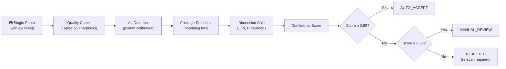
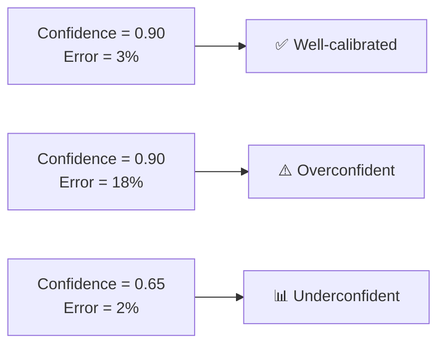
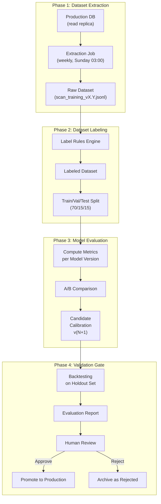
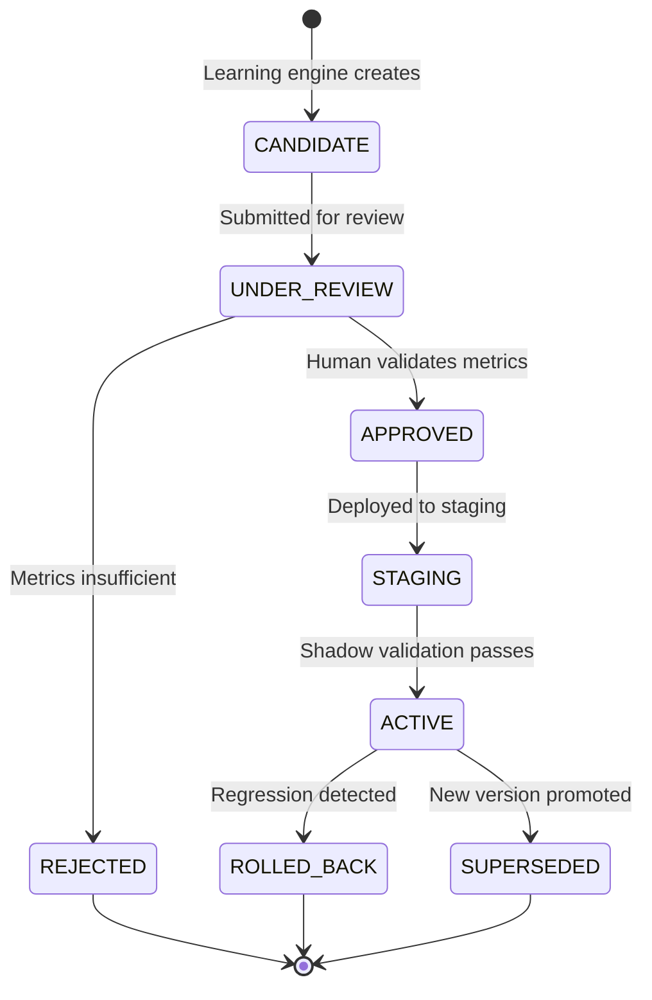
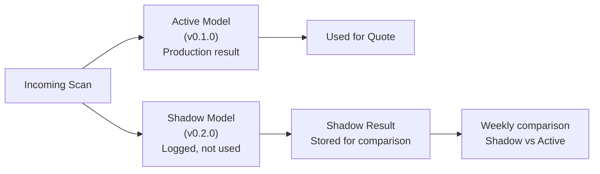

# VolumeScan AI — Accuracy Improvement Loop

> **Version**: 1.0 — 2026-02-07
> **Author**: Senior Computer Vision Engineer
> **Status**: DRAFT — Pending Review
> **Parent Spec**: [Learning System Specification](./LEARNING_SYSTEM_SPEC.md) — Loop 1

---

## 1. System Context

### 1.1 VolumeScan MVP Summary

VolumeScan estimates package dimensions (L × W × H) from a **single photograph** using a white **A4 sheet** (210 × 297 mm) as a mandatory calibration reference.



### 1.2 Current Performance Baseline

| Metric | Current Value | Target |
|:---|:---|:---|
| Dimension tolerance | ±10% | ±5% |
| Auto-accept threshold | `confidenceScore ≥ 0.85` | Calibrated per hub |
| Manual review threshold | `confidenceScore ≥ 0.60` | Calibrated per failure mode |
| Manual validation rate | Unknown (to be measured) | < 15% |
| Model version | `v0.1.0` | Tracked in `ScanResult.modelVersion` |

### 1.3 Existing Data Assets

The platform already captures rich correction data via the existing `ScanResult` schema:

| Field | Type | Learning Signal |
|:---|:---|:---|
| `detectedLengthCm` / `detectedWidthCm` / `detectedHeightCm` | `Decimal` | AI prediction |
| `validatedLengthCm` / `validatedWidthCm` / `validatedHeightCm` | `Decimal` | Human ground truth |
| `confidenceScore` | `Decimal(5,4)` | Calibration signal |
| `modelVersion` | `String` | Version tracking |
| `rawAiOutput` | `Json` | Full pipeline diagnostics |
| `inputImageHash` | `String` | Image deduplication |
| `hubId` | `String` | Hub-level segmentation |
| `source` | `String` | AI vs MANUAL origin |
| `processingTimeMs` | `Int` | Latency tracking |

> [!IMPORTANT]
> The existing `ScanResult` model already stores both AI-predicted and human-validated dimensions side by side. This is the **primary training signal** — no new production tables are required for Phase 1.

---

## 2. Training Signal Identification

### 2.1 Signal 1 — AI vs Manual Correction Deltas

The **highest-value** signal. Every time an operator calls `validateScan()`, we capture the gap between what the AI predicted and what a human measured.

```typescript
// Extracted from existing ScanResult records where:
//   status = 'VALIDATED'
//   validatedLengthCm IS NOT NULL
//   detectedLengthCm IS NOT NULL

interface DimensionDelta {
  scanResultId: string;
  shipmentId: string;
  hubId: string;
  modelVersion: string;

  // Per-axis absolute error
  deltaLengthCm: number;    // |detected - validated|
  deltaWidthCm: number;
  deltaHeightCm: number;

  // Per-axis relative error (%)
  errorLengthPct: number;   // |delta| / validated × 100
  errorWidthPct: number;
  errorHeightPct: number;

  // Directional bias (positive = AI overestimates)
  biasLengthCm: number;     // detected - validated (signed)
  biasWidthCm: number;
  biasHeightCm: number;

  // Overall composite error
  volumeErrorPct: number;   // |predictedVol - actualVol| / actualVol × 100

  // Context
  confidenceScore: number;
  processingTimeMs: number;
  createdAt: Date;
}
```

#### Extraction Query Pattern
```sql
SELECT
  sr.id,
  sr."shipmentId",
  sr."hubId",
  sr."modelVersion",
  sr."confidenceScore",
  -- Absolute deltas
  ABS(sr."detectedLengthCm" - sr."validatedLengthCm") AS "deltaLengthCm",
  ABS(sr."detectedWidthCm"  - sr."validatedWidthCm")  AS "deltaWidthCm",
  ABS(sr."detectedHeightCm" - sr."validatedHeightCm") AS "deltaHeightCm",
  -- Directional bias
  (sr."detectedLengthCm" - sr."validatedLengthCm") AS "biasLengthCm",
  (sr."detectedWidthCm"  - sr."validatedWidthCm")  AS "biasWidthCm",
  (sr."detectedHeightCm" - sr."validatedHeightCm") AS "biasHeightCm",
  -- Relative error (%)
  ABS(sr."detectedLengthCm" - sr."validatedLengthCm")
    / NULLIF(sr."validatedLengthCm", 0) * 100 AS "errorLengthPct"
FROM scan_results sr
WHERE sr.status = 'VALIDATED'
  AND sr."validatedLengthCm" IS NOT NULL
  AND sr."detectedLengthCm" IS NOT NULL
  AND sr."modelVersion" = $1  -- filter by model version
ORDER BY sr."createdAt" DESC;
```

---

### 2.2 Signal 2 — Confidence Score vs Actual Accuracy

Evaluates whether the model's self-reported confidence correlates with real accuracy.



#### Analysis: Confidence Calibration Curve

Bin confidence scores into deciles and compute the actual error rate per bin:

```typescript
interface ConfidenceCalibrationBin {
  binRange: { min: number; max: number };   // e.g. [0.80, 0.90)
  sampleCount: number;
  meanConfidence: number;
  meanActualErrorPct: number;               // Mean composite dimension error
  medianActualErrorPct: number;
  autoAcceptedCount: number;                // How many bypassed manual review
  autoAcceptedErrorAbove10Pct: number;      // Among auto-accepted, how many exceeded ±10%
}
```

**Key Outputs**:
- **ECE (Expected Calibration Error)**: Measures mean gap between confidence and actual accuracy across bins
- **Overconfidence zones**: Bins where `meanActualErrorPct > (1 - meanConfidence) × 100`
- **Threshold recommendations**: Optimal `AUTO_ACCEPT` and `MANUAL_REVIEW` thresholds based on actual miss rates

---

### 2.3 Signal 3 — Failure Case Taxonomy

Not all scan errors are equal. Categorizing failures enables targeted pipeline improvements.

#### 2.3.1 Failure Classification

| Failure Mode | Detection Method | Pipeline Stage Affected |
|:---|:---|:---|
| **Bad lighting** | Laplacian variance < threshold in `rawAiOutput` | Quality Check |
| **A4 not detected** | A4 confidence = 0 or aspect ratio mismatch | A4 Detection |
| **A4 partial occlusion** | A4 area < expected (< 80% of standard) | A4 Detection |
| **Package occlusion** | Package edges incomplete or intersect image border | Package Detection |
| **Multi-package** | Multiple bounding boxes detected | Package Detection |
| **Non-rectangular** | Package shape deviates from cuboid assumption | Dimension Calc |
| **Scale ambiguity** | A4 too far from package, parallax distortion | Dimension Calc |
| **Height estimation** | Systematic H error (heuristic weakness) | Dimension Calc |
| **Dark/reflective surface** | Low contrast between package and background | Package Detection |
| **Unusual aspect ratio** | Very elongated or very flat items | Dimension Calc |

#### 2.3.2 Failure Signal Data Contract

```typescript
interface ScanFailureRecord {
  scanResultId: string;
  modelVersion: string;
  hubId: string;

  // Classification
  failureMode: FailureMode;          // From taxonomy above
  pipelineStage: PipelineStage;      // QUALITY_CHECK | A4_DETECTION | PACKAGE_DETECTION | DIMENSION_CALC
  severity: 'MINOR' | 'MAJOR' | 'CRITICAL';

  // Evidence
  confidenceScore: number;
  dimensionErrorPct: number;         // Composite error if correction available
  rawDiagnostics: {
    laplacianVariance?: number;      // Sharpness metric
    a4DetectionConfidence?: number;
    a4DetectedAreaPx?: number;
    packageBoundingBoxCount?: number;
    aspectRatioDeviation?: number;
  };

  // Derived from rawAiOutput JSON
  extractedAt: Date;
}

type FailureMode =
  | 'BAD_LIGHTING'
  | 'A4_NOT_DETECTED'
  | 'A4_PARTIAL_OCCLUSION'
  | 'PACKAGE_OCCLUSION'
  | 'MULTI_PACKAGE'
  | 'NON_RECTANGULAR'
  | 'SCALE_AMBIGUITY'
  | 'HEIGHT_ESTIMATION'
  | 'DARK_REFLECTIVE_SURFACE'
  | 'UNUSUAL_ASPECT_RATIO'
  | 'UNKNOWN';

type PipelineStage =
  | 'QUALITY_CHECK'
  | 'A4_DETECTION'
  | 'PACKAGE_DETECTION'
  | 'DIMENSION_CALC';
```

---

## 3. Offline Learning Design

### 3.1 Architecture



### 3.2 Dataset Extraction

#### 3.2.1 Extraction Schedule

| Parameter | Value |
|:---|:---|
| **Frequency** | Weekly (Sunday 03:00 Africa/Abidjan) |
| **Source** | Read replica of production database |
| **Format** | JSONL (one record per line) |
| **Storage** | `data/training/scan_training_vX.Y.jsonl` |
| **Retention** | Last 12 weekly extractions |

#### 3.2.2 Extraction Criteria

A `ScanResult` record qualifies for the training dataset when **all** conditions are met:

```typescript
const EXTRACTION_CRITERIA = {
  // Must have AI predictions
  detectedLengthCm: { not: null },
  detectedWidthCm: { not: null },
  detectedHeightCm: { not: null },
  confidenceScore: { not: null },

  // Model version tracking
  modelVersion: { not: null },

  // Status must be terminal
  status: { in: ['COMPLETED', 'VALIDATED', 'REJECTED'] },
};
```

**Record classification**:
- `status = VALIDATED` → **Gold label** (human ground truth available)
- `status = COMPLETED` + auto-accepted → **Silver label** (implicitly correct — not corrected)
- `status = REJECTED` → **Negative sample** (scan was bad enough to reject)

#### 3.2.3 Dataset Record Schema

```typescript
interface TrainingRecord {
  // Identity
  scanResultId: string;
  datasetVersion: string;        // e.g. "2026-W06"
  extractedAt: Date;

  // Classification
  labelQuality: 'GOLD' | 'SILVER' | 'NEGATIVE';
  labelSource: 'MANUAL_CORRECTION' | 'AUTO_ACCEPTED' | 'REJECTED';

  // Input features
  inputImageHash: string;
  referenceObject: 'A4';
  hubId: string;

  // AI predictions
  predicted: {
    lengthCm: number;
    widthCm: number;
    heightCm: number;
    confidence: number;
    processingTimeMs: number;
    modelVersion: string;
  };

  // Ground truth (null for SILVER and NEGATIVE)
  groundTruth: {
    lengthCm: number;
    widthCm: number;
    heightCm: number;
    source: 'SCALE' | 'TAPE' | 'OPERATOR' | 'UNKNOWN';
    validatedByUserId: string;
    validatedAt: Date;
  } | null;

  // Error metrics (computed during extraction, null if no ground truth)
  errors: {
    absoluteErrorL: number;
    absoluteErrorW: number;
    absoluteErrorH: number;
    relativeErrorL: number;   // %
    relativeErrorW: number;   // %
    relativeErrorH: number;   // %
    biasL: number;            // Signed (positive = overestimate)
    biasW: number;
    biasH: number;
    volumeErrorPct: number;
  } | null;

  // Pipeline diagnostics (from rawAiOutput)
  diagnostics: {
    laplacianVariance?: number;
    a4DetectionConfidence?: number;
    a4AspectRatioDelta?: number;
    packageBboxCount?: number;
    imageWidthPx?: number;
    imageHeightPx?: number;
  };

  // Failure classification (determined by label rules)
  failureMode: FailureMode | null;
  pipelineStageAffected: PipelineStage | null;
}
```

---

### 3.3 Dataset Labeling Rules

Labeling transforms raw `ScanResult` records into categorized training data. All rules are **deterministic** and **versioned**.

#### 3.3.1 Label Assignment Rules

```typescript
const LABELING_RULES_V1 = {
  version: '1.0.0',

  rules: [
    {
      id: 'GOLD_VALIDATED',
      condition: 'status === "VALIDATED" AND validatedLengthCm IS NOT NULL',
      label: 'GOLD',
      description: 'Operator measured and corrected the AI prediction',
    },
    {
      id: 'SILVER_AUTO_ACCEPTED',
      condition: 'status === "COMPLETED" AND confidenceScore >= 0.85 AND validatedLengthCm IS NULL',
      label: 'SILVER',
      description: 'AI auto-accepted, no correction needed (assumed correct)',
    },
    {
      id: 'NEGATIVE_REJECTED',
      condition: 'status === "REJECTED"',
      label: 'NEGATIVE',
      description: 'Scan failed and was rejected by operator',
    },
    {
      id: 'SILVER_MANUAL_NO_CHANGE',
      condition: 'status === "VALIDATED" AND validatedLengthCm IS NOT NULL AND allDeltasBelow(2)',
      label: 'SILVER',
      description: 'Operator validated but changed nothing significant (<2cm per axis)',
    },
  ],
};
```

#### 3.3.2 Failure Mode Classification Rules

```typescript
const FAILURE_CLASSIFICATION_RULES_V1 = {
  version: '1.0.0',

  rules: [
    {
      id: 'HEIGHT_SYSTEMATIC',
      condition: 'abs(biasH) > 3 * max(abs(biasL), abs(biasW))',
      failureMode: 'HEIGHT_ESTIMATION',
      description: 'Height error dominates — heuristic weakness',
    },
    {
      id: 'BAD_LIGHTING',
      condition: 'diagnostics.laplacianVariance < 50',
      failureMode: 'BAD_LIGHTING',
      description: 'Image too blurry or poorly lit',
    },
    {
      id: 'A4_MISSING',
      condition: 'diagnostics.a4DetectionConfidence < 0.3',
      failureMode: 'A4_NOT_DETECTED',
      description: 'A4 reference sheet not visible or detectable',
    },
    {
      id: 'MULTI_PKG',
      condition: 'diagnostics.packageBboxCount > 1',
      failureMode: 'MULTI_PACKAGE',
      description: 'Multiple packages detected in frame',
    },
    {
      id: 'OVERESTIMATE_ALL',
      condition: 'biasL > 0 AND biasW > 0 AND biasH > 0 AND volumeErrorPct > 15',
      failureMode: 'SCALE_AMBIGUITY',
      description: 'Systematic overestimation suggests calibration error',
    },
  ],
};
```

> [!NOTE]
> Labeling rules are versioned alongside model versions. When rules change, the dataset is re-labeled to maintain consistency. Rule version is tracked in every `TrainingRecord`.

---

### 3.4 Model Evaluation Metrics

#### 3.4.1 Primary Metrics

| Metric | Formula | Target | Description |
|:---|:---|:---|:---|
| **MAE-L** | mean(\|predicted_L - actual_L\|) | ≤ 1.5 cm | Mean Absolute Error on Length |
| **MAE-W** | mean(\|predicted_W - actual_W\|) | ≤ 1.5 cm | Mean Absolute Error on Width |
| **MAE-H** | mean(\|predicted_H - actual_H\|) | ≤ 2.0 cm | Mean Absolute Error on Height (looser due to heuristic) |
| **MAPE** | mean(\|predicted - actual\| / actual) × 100 | ≤ 5% | Mean Absolute Percentage Error (composite) |
| **Volume MAPE** | \|V_pred - V_actual\| / V_actual × 100 | ≤ 8% | Volume-level accuracy |
| **Within-5%** | % of scans with all axes within ±5% | ≥ 80% | Production accuracy target |
| **Within-10%** | % of scans with all axes within ±10% | ≥ 95% | Minimum acceptable accuracy |

#### 3.4.2 Calibration Metrics

| Metric | Formula | Target | Description |
|:---|:---|:---|:---|
| **ECE** | Σ (bin_weight × \|confidence - accuracy\|) | ≤ 0.05 | Expected Calibration Error |
| **Overconfidence rate** | % of auto-accepted scans with error > 10% | ≤ 2% | Risk of silently bad scans |
| **Underconfidence rate** | % of manual-review scans with error < 3% | ≤ 20% | Unnecessary manual reviews |

#### 3.4.3 Operational Metrics

| Metric | Formula | Target | Description |
|:---|:---|:---|:---|
| **Auto-accept rate** | % scans above `AUTO_ACCEPT` threshold | ≥ 75% | Operational efficiency |
| **Manual review rate** | % scans requiring human validation | ≤ 20% | Hub workload indicator |
| **Reject rate** | % scans below `MANUAL_REVIEW` threshold | ≤ 5% | Image quality signal |
| **Processing latency P95** | 95th percentile of `processingTimeMs` | ≤ 3000ms | SLA compliance |

#### 3.4.4 Segmented Analysis

All metrics are computed both globally and segmented by:

| Segment | Dimension | Rationale |
|:---|:---|:---|
| **Hub** | `hubId` | Different lighting, equipment, operator skill |
| **Package size** | Small/Medium/Large/XL bins | Model accuracy varies by scale |
| **Confidence band** | 0.6–0.7, 0.7–0.8, 0.8–0.9, 0.9+ | Calibration quality per band |
| **Time period** | Weekly cohorts | Detect temporal drift |
| **Failure mode** | From taxonomy | Prioritize targeted fixes |

---

## 4. Learning Outputs

### 4.1 Output 1 — Detection Heuristic Improvements

Specific, explainable changes to the CV pipeline parameters.

```typescript
interface HeuristicImprovement {
  id: string;
  version: string;
  candidateModelVersion: string;    // e.g. "v0.2.0"
  parentModelVersion: string;       // e.g. "v0.1.0"
  status: 'CANDIDATE' | 'UNDER_REVIEW' | 'APPROVED' | 'REJECTED' | 'ACTIVE';

  improvements: HeuristicChange[];
  evaluationReport: EvaluationReport;
  createdAt: Date;
}

interface HeuristicChange {
  pipelineStage: PipelineStage;
  parameter: string;                // e.g. "a4_aspect_ratio_tolerance"
  currentValue: number | string;
  proposedValue: number | string;
  reasoning: string;
  evidenceSampleSize: number;
  expectedImpact: string;           // e.g. "Reduces A4 detection failures by ~30%"
}
```

**Example improvements** the loop can recommend:

| Pipeline Stage | Parameter | Current | Proposed | Evidence |
|:---|:---|:---|:---|:---|
| Quality Check | `minLaplacianVariance` | 100 | 80 | 12% of GOLD scans have variance 80–100, all with < 5% error |
| A4 Detection | `aspectRatioTolerance` | 0.05 | 0.08 | Worn/folded A4 sheets at Hub ABJ show natural deviation up to 0.07 |
| Dimension Calc | `heightMultiplier` | 0.30 | 0.35 | Systematic -12% height bias across 234 GOLD samples |
| Dimension Calc | `hubCalibrationOffset.ABJ.length` | 0 cm | +0.8 cm | Hub ABJ shows consistent +0.8cm length underestimate (n=89) |

---

### 4.2 Output 2 — Confidence Calibration Improvements

Adjusted confidence scoring to better reflect actual accuracy.

```typescript
interface ConfidenceCalibration {
  id: string;
  version: string;
  status: 'CANDIDATE' | 'UNDER_REVIEW' | 'APPROVED' | 'ACTIVE';

  // Threshold changes
  thresholds: {
    autoAccept: {
      current: number;            // 0.85
      proposed: number;           // e.g. 0.82 or 0.88
      reasoning: string;
    };
    manualReview: {
      current: number;            // 0.60
      proposed: number;
      reasoning: string;
    };
  };

  // Per-hub overrides (if accuracy varies by hub)
  hubOverrides: {
    hubId: string;
    hubCode: string;
    autoAcceptOverride: number;
    manualReviewOverride: number;
    reasoning: string;            // "Hub BKE has lower lighting quality..."
    sampleSize: number;
  }[];

  // Calibration curve data (for dashboard visualization)
  calibrationCurve: ConfidenceCalibrationBin[];

  // Impact projection
  projectedAutoAcceptRate: number;
  projectedManualReviewRate: number;
  projectedOverconfidenceRate: number;

  evaluationReport: EvaluationReport;
  createdAt: Date;
}
```

---

### 4.3 Output 3 — Model Versioning Protocol

Every learning output is a **candidate**, never production by default.



#### Version Naming Convention

```
volumescan-v{MAJOR}.{MINOR}.{PATCH}

MAJOR: Breaking pipeline change (new detection approach)
MINOR: Heuristic/threshold improvement (calibration updates)
PATCH: Minor parameter tweak (single hub offset)

Examples:
  v0.1.0  → MVP baseline (current)
  v0.1.1  → Hub-specific calibration offsets
  v0.2.0  → Height heuristic improvement
  v1.0.0  → New detection backbone (if ever)
```

#### Version Registry

```typescript
interface ModelVersionRecord {
  version: string;                // "v0.2.0"
  parentVersion: string;          // "v0.1.0"
  status: 'CANDIDATE' | 'APPROVED' | 'ACTIVE' | 'SUPERSEDED' | 'ROLLED_BACK';

  // What changed
  changelog: string[];            // Human-readable list of changes
  changedParameters: Record<string, { from: unknown; to: unknown }>;

  // Evaluation
  evaluationDatasetVersion: string;  // "2026-W06"
  evaluationResults: EvaluationReport;

  // Lifecycle
  createdAt: Date;
  approvedAt?: Date;
  approvedByUserId?: string;
  activatedAt?: Date;
  deactivatedAt?: Date;
  deactivationReason?: string;

  // Rollback support
  canRollbackTo: string;          // Previous known-good version
}
```

---

## 5. Evaluation Report Structure

Every candidate generates a standardized evaluation report that enables informed human decision-making.

```typescript
interface EvaluationReport {
  reportId: string;
  candidateVersion: string;
  baselineVersion: string;
  datasetVersion: string;
  generatedAt: Date;

  // Dataset stats
  dataset: {
    totalRecords: number;
    goldRecords: number;
    silverRecords: number;
    negativeRecords: number;
    hubDistribution: Record<string, number>;
    dateRange: { from: Date; to: Date };
  };

  // Head-to-head comparison
  comparison: {
    metric: string;
    baseline: number;
    candidate: number;
    delta: number;
    deltaPercent: number;
    improved: boolean;
  }[];

  // Segmented results
  segmented: {
    dimension: string;            // "hub", "packageSize", "confidenceBand"
    segment: string;              // "ABJ", "LARGE", "0.8-0.9"
    metrics: Record<string, number>;
  }[];

  // Risk assessment
  risks: {
    description: string;
    severity: 'LOW' | 'MEDIUM' | 'HIGH';
    mitigation: string;
  }[];

  // Recommendation
  recommendation: 'PROMOTE' | 'NEEDS_MORE_DATA' | 'REJECT';
  recommendationReason: string;
}
```

### 5.1 Promotion Criteria

A candidate version **may** be promoted to `APPROVED` only when **all** of the following are satisfied:

| Criterion | Threshold | Non-Negotiable? |
|:---|:---|:---|
| GOLD sample size | ≥ 50 records | ✅ Yes |
| MAPE (composite) | ≤ current version MAPE | ✅ Yes |
| Within-10% rate | ≥ 95% | ✅ Yes |
| Within-5% rate | ≥ candidate target | ❌ Aspirational |
| No single hub regression | MAE per hub ≤ baseline + 0.5cm | ✅ Yes |
| Overconfidence rate | ≤ 3% | ✅ Yes |
| Processing latency P95 | ≤ 3000ms | ✅ Yes |
| ECE | ≤ baseline ECE | ❌ Aspirational |

> [!CAUTION]
> A candidate that **improves globally but regresses on any single hub** must NOT be auto-promoted. Hub-level regression requires explicit human review and justification.

---

## 6. Shadow Validation Protocol

Before full activation, an `APPROVED` candidate runs in **shadow mode** alongside the active model.



### 6.1 Shadow Mode Rules

| Rule | Value |
|:---|:---|
| **Duration** | Minimum 7 days OR 100 scans (whichever comes last) |
| **Impact on production** | Zero — shadow results are never used for quotes |
| **Storage** | `ScanShadowResult` table (separate from production `ScanResult`) |
| **Comparison** | Weekly automated report comparing shadow vs active accuracy |
| **Promotion trigger** | Shadow outperforms active on all non-negotiable criteria |
| **Abort trigger** | Shadow latency P95 > 5000ms OR crash rate > 1% |

---

## 7. Operational Workflow

### 7.1 End-to-End Timeline

```
Week 1 (Sun):  Dataset extraction job runs → scan_training_v2026-W06.jsonl
Week 1 (Mon):  Labeling rules applied → labeled dataset generated
Week 1 (Tue):  Evaluation metrics computed for current model
Week 1 (Wed):  If sufficient GOLD data: heuristic analysis runs
Week 1 (Thu):  Candidate improvements generated → Evaluation Report created
Week 1 (Fri):  Candidate submitted for human review

Week 2:        Human reviews → Approve / Reject / Request more data
               If Approved → Shadow mode activated

Week 3-4:      Shadow validation period (7-14 days)

Week 4 (Fri):  Shadow comparison report → Promote / Extend / Abort

Post-promote:  Old model → SUPERSEDED, New model → ACTIVE
               7-day monitoring window with auto-rollback triggers
```

### 7.2 Rollback Protocol

If a newly promoted model shows regression in production:

| Signal | Threshold | Action |
|:---|:---|:---|
| Manual validation rate spike | > 2× baseline over 48h | **Alert** operations team |
| Mean dimension error increase | > 15% degradation over 7d | **Auto-rollback** to `canRollbackTo` version |
| Confidence calibration drift | ECE > 0.10 | **Alert** with review deadline |
| Processing latency P95 | > 5000ms for 1h | **Immediate rollback** |

Rollback is **atomic**: a single database update sets the active model version back to the previous known-good version. All pipeline instances read the version from configuration at request time.

---

## 8. Implementation Phases

### Phase A — Instrumentation (Data Collection)
- Ensure `rawAiOutput` captures full pipeline diagnostics (Laplacian, A4 confidence, bbox count)
- Add `measurementMethod` field to `validateScan()` input
- Implement extraction job (read replica → JSONL export)
- No model changes

### Phase B — Analysis Dashboard
- Build weekly metrics computation job
- Create VolumeScan Accuracy Dashboard (extension of existing Analytics Dashboard)
- Visualize: error distributions, calibration curve, hub heatmap, failure mode breakdown
- Establish baseline metrics for `v0.1.0`

### Phase C — Candidate Pipeline
- Implement labeling rules engine
- Implement evaluation report generator
- Build candidate review workflow (UI + approval gates)
- Generate first `v0.1.1` candidate (hub-specific calibration offsets)

### Phase D — Shadow Mode
- Implement `ScanShadowResult` storage
- Build dual-execution pipeline (active + shadow)
- Automated shadow comparison reports
- First full promotion cycle

---

## 9. Appendix — Key Risks & Mitigations

| Risk | Impact | Mitigation |
|:---|:---|:---|
| Insufficient GOLD data | Can't evaluate candidates | Set minimum 50 GOLD records; incentivize hub operators to measure |
| Operator measurement errors | Corrupted ground truth | Cross-validate: flag corrections > 30% delta for secondary review |
| SILVER label contamination | Auto-accepted errors treated as correct | Periodically sample SILVER for manual verification (5% random audit) |
| Hub-specific overfitting | Model improves at Hub A but regresses at Hub B | Per-hub regression gate in promotion criteria |
| Concept drift | Package types, lighting evolve | Monthly dataset refresh; age-weighted training (recent data weighted higher) |
| Shadow mode latency | Dual execution doubles compute | Shadow runs on separate worker; timeout at 5s with graceful skip |
